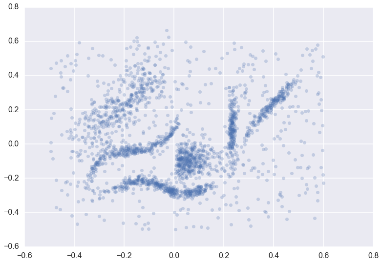
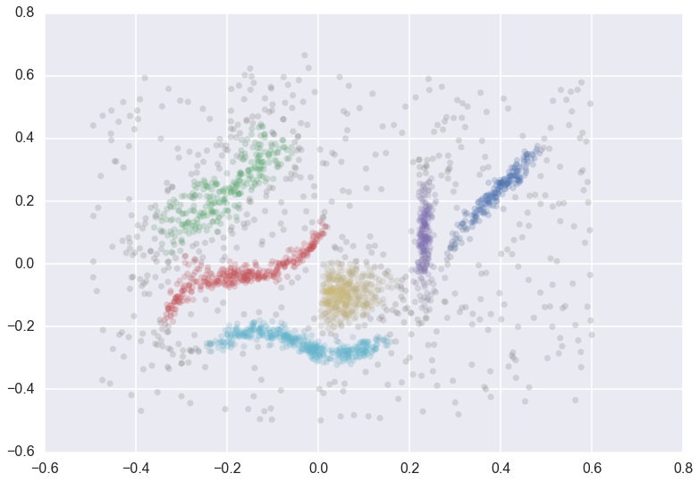
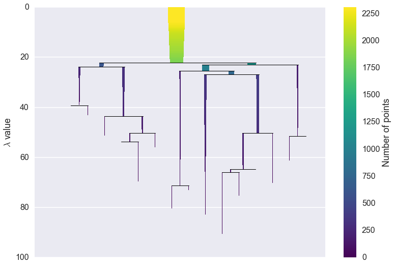
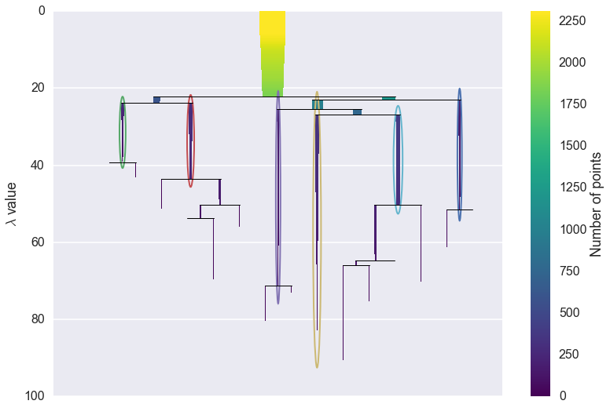
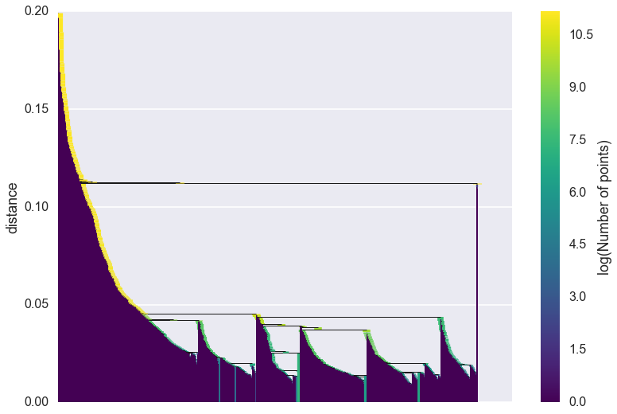

Getting More Information About a Clustering
===========================================

Once you have the basics of clustering sorted you may want to dig a
little deeper than just the cluster labels returned to you. Fortunately, the hdbscan library provides you with the facilities to do this. During
processing HDBSCAN\* builds a hierarchy of potential clusters, from
which it extracts the flat clustering returned. It can be informative to
look at that hierarchy, and potentially make use of the extra
information contained therein.

Suppose we have a dataset for clustering. It is a binary file in NumPy format and it can be found at https://github.com/lmcinnes/hdbscan/blob/master/notebooks/clusterable_data.npy.

.. code:: python

    import hdbscan
    import numpy as np
    import matplotlib.pyplot as plt
    import seaborn as sns
    %matplotlib inline
    
.. code:: python

    data = np.load('clusterable_data.bin')
    #or
    data = np.load('clusterable_data.npy')
    #depending on the format of the file
    
.. code:: python

    data.shape
    
.. parsed-literal::

    (2309, 2)
    
.. code:: python

    data
    
.. parsed-literal::

    array([[-0.12153499, -0.22876337],
       [-0.22093687, -0.25251088],
       [ 0.1259037 , -0.27314321],
       ..., 
       [ 0.50243143, -0.3002958 ],
       [ 0.53822256,  0.19412199],
       [-0.08688887, -0.2092721 ]])

    
.. code:: python

    plt.scatter(*data.T, s=50, linewidth=0, c='b', alpha=0.25)
    
.. parsed-literal::

    <matplotlib.collections.PathCollection at 0x7f6b61ad6e10>

We can cluster the data as normal, and visualize the labels with
different colors (and even the cluster membership strengths as levels of
saturation)

.. code:: python

    clusterer = hdbscan.HDBSCAN(min_cluster_size=15).fit(data)
    color_palette = sns.color_palette('deep', 8)
    cluster_colors = [color_palette[x] if x >= 0 
                      else (0.5, 0.5, 0.5) 
                      for x in clusterer.labels_]
    cluster_member_colors = [sns.desaturate(x, p) for x, p in 
                             zip(cluster_colors, clusterer.probabilities_)]
    plt.scatter(*data.T, s=50, linewidth=0, c=cluster_member_colors, alpha=0.25)

Condensed Trees
---------------

The question now is what does the cluster hierarchy look like -- which
clusters are near each other, or could perhaps be merged, and which are
far apart. We can access the basic hierarchy via the :py:attr:`~hdbscan.HDBSCAN.condensed_tree_`
attribute of the clusterer object.

.. code:: python

    clusterer.condensed_tree_

.. parsed-literal::

    <hdbscan.plots.CondensedTree at 0x10ea23a20>

This merely gives us a :class:`~hdbscan.plots.CondensedTree` object. If we want to visualize the
hierarchy we can call the :py:meth:`~hdbscan.plots.CondensedTree.plot` method:

.. code:: python

    clusterer.condensed_tree_.plot()

We can now see the hierarchy as a dendrogram, the width (and color) of
each branch representing the number of points in the cluster at that
level. If we wish to know which branches were selected by the HDBSCAN\*
algorithm we can pass ``select_clusters=True``. You can even pass a
selection palette to color the selections according to the cluster
labeling.

.. code:: python

    clusterer.condensed_tree_.plot(select_clusters=True, 
                                   selection_palette=sns.color_palette('deep', 8))

From this, we can see, for example, that the yellow cluster at the
center of the plot forms early (breaking off from the pale blue and
purple clusters) and persists for a long time. By comparison the green
cluster, which also forms early, quickly breaks apart and then
vanishes altogether (shattering into clusters all smaller than the
``min_cluster_size`` of 15).

You can also see that the pale blue cluster breaks apart into several
subclusters that in turn persist for quite some time -- so there is some
interesting substructure to the pale blue cluster that is not present,
for example, in the dark blue cluster.

If this was a simple visual analysis of the condensed tree can tell you
a lot more about the structure of your data. This is not all we can do
with condensed trees, however. For larger and more complex datasets the
tree itself may be very complex, and it may be desirable to run more
interesting analytics over the tree itself. This can be achieved via
several converter methods: :py:meth:`~hdbscan.plots.CondensedTree.to_networkx`, :py:meth:`~hdbscan.plots.CondensedTree.to_pandas`, and
:py:meth:`~hdbscan.plots.CondensedTree.to_numpy`.

First we'll consider :py:meth:`~hdbscan.plots.CondensedTree.to_networkx`

.. code:: python

    clusterer.condensed_tree_.to_networkx()

.. parsed-literal::

    <networkx.classes.digraph.DiGraph at 0x11d8023c8>

As you can see we get a NetworkX directed graph, which we can then use
all the regular NetworkX tools and analytics on. The graph is richer
than the visual plot above may lead you to believe, however:

.. code:: python

    g = clusterer.condensed_tree_.to_networkx()
    g.number_of_nodes()

.. parsed-literal::

    2338

The graph actually contains nodes for all the points falling out of
clusters as well as the clusters themselves. Each node has an associated
``size`` attribute and each edge has a ``weight`` of the lambda value
at which that edge forms. This allows for much more interesting
analyses.

Next, we have the :py:meth:`~hdbscan.plots.CondensedTree.to_pandas` method, which returns a panda DataFrame
where each row corresponds to an edge of the NetworkX graph:

.. code:: python

    clusterer.condensed_tree_.to_pandas().head()

.. raw:: html

    

    <table border="1" class="dataframe">
      <thead>
        <tr style="text-align: right;">
          <th></th>
          <th>parent</th>
          <th>child</th>
          <th>lambda_val</th>
          <th>child_size</th>
        </tr>
      </thead>
      <tbody>
        <tr>
          <th>0</th>
          <td>2309</td>
          <td>2048</td>
          <td>5.016526</td>
          <td>1</td>
        </tr>
        <tr>
          <th>1</th>
          <td>2309</td>
          <td>2006</td>
          <td>5.076503</td>
          <td>1</td>
        </tr>
        <tr>
          <th>2</th>
          <td>2309</td>
          <td>2024</td>
          <td>5.279133</td>
          <td>1</td>
        </tr>
        <tr>
          <th>3</th>
          <td>2309</td>
          <td>2050</td>
          <td>5.347332</td>
          <td>1</td>
        </tr>
        <tr>
          <th>4</th>
          <td>2309</td>
          <td>1992</td>
          <td>5.381930</td>
          <td>1</td>
        </tr>
      </tbody>
    </table>
    

Here the ``parent`` denotes the id of the parent cluster, the ``child``
the id of the child cluster (or, if the child is a single data point
rather than a cluster, the index in the dataset of that point), the
``lambda_val`` provides the lambda value at which the edge forms, and
the ``child_size`` provides the number of points in the child cluster.
As you can see the start of the DataFrame has singleton points falling
out of the root cluster, with each ``child_size`` equal to 1.

If you want just the clusters, rather than all the individual points
as well, simply select the rows of the DataFrame with ``child_size``
greater than 1.

.. code:: python

    tree = clusterer.condensed_tree_.to_pandas()
    cluster_tree = tree[tree.child_size > 1]

Finally we have the :py:meth:`~hdbscan.plots.CondensedTree.to_numpy` function, which returns a numpy record
array:

.. code:: python

    clusterer.condensed_tree_.to_numpy()

.. parsed-literal::

    array([(2309, 2048, 5.016525967983049, 1),
           (2309, 2006, 5.076503128308643, 1),
           (2309, 2024, 5.279133057912248, 1), ...,
           (2318, 1105, 86.5507370650292, 1), (2318, 965, 86.5507370650292, 1),
           (2318, 954, 86.5507370650292, 1)], 
          dtype=[('parent', '<i8'), ('child', '<i8'), ('lambda_val', '<f8'), ('child_size', '<i8')])

This is equivalent to the pandas DataFrame but is in pure NumPy and
hence has no pandas dependencies if you do not wish to use pandas.

Single Linkage Trees
--------------------

We have still more data at our disposal, however. As noted in the How
HDBSCAN Works section, prior to providing a condensed tree the algorithm
builds a complete dendrogram. We have access to this too via the
:py:attr:`~hdbscan.HDBSCAN.single_linkage_tree_` attribute of the clusterer.

.. code:: python

    clusterer.single_linkage_tree_

.. parsed-literal::

    <hdbscan.plots.SingleLinkageTree at 0x121d4b128>

Again we have an object which we can then query for relevant
information. The most basic approach is the :py:meth:`~hdbscan.plots.SingleLinkageTree.plot` method, just like
the condensed tree.

.. code:: python

    clusterer.single_linkage_tree_.plot()

As you can see we gain a lot from condensing the tree in terms of better
presenting and summarising the data. There is a lot less to be gained
from visual inspection of a plot like this (and it only gets worse for
larger datasets). The plot function support most of the same
functionality as the dendrogram plotting from
``scipy.cluster.hierarchy``, so you can view various truncations of the
tree if necessary. In practice, however, you are more likely to be
interested in access the raw data for further analysis. Again we have
:py:meth:`~hdbscan.plots.SingleLinkageTree.to_networkx`, :py:meth:`~hdbscan.plots.SingleLinkageTree.to_pandas` and :py:meth:`~hdbscan.plots.SingleLinkageTree.to_numpy`. This time the
:py:meth:`~hdbscan.plots.SingleLinkageTree.to_networkx` provides a direct NetworkX version of what you see
above. The NumPy and pandas results conform to the single linkage
hierarchy format of ``scipy.cluster.hierarchy``, and can be passed to
routines there if necessary.

If you wish to know what the clusters are at a given fixed level of the
single linkage tree you can use the :py:meth:`~hdbscan.plots.SingleLinkageTree.get_clusters` method to extract
a vector of cluster labels. The method takes a cut value of the level
at which to cut the tree, and a ``minimum_cluster_size`` to determine
noise points (any cluster smaller than the ``minimum_cluster_size``).

.. code:: python

    clusterer.single_linkage_tree_.get_clusters(0.023, min_cluster_size=2)

.. parsed-literal::

    array([ 0, -1,  0, ..., -1, -1,  0])

In this way, it is possible to extract the DBSCAN clustering that would result
for any given epsilon value, all from one run of hdbscan.

