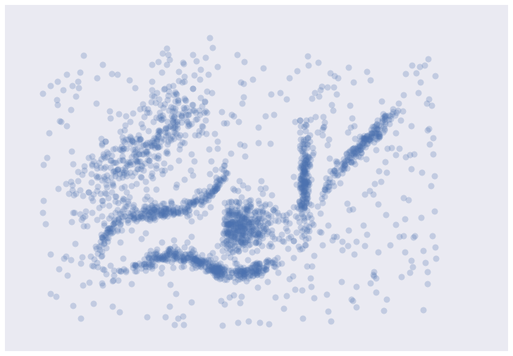
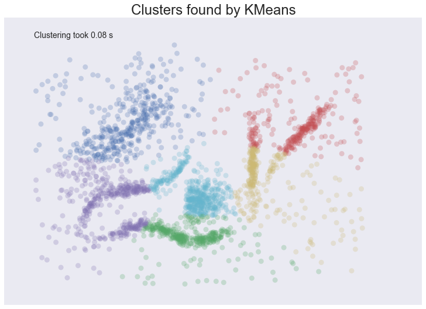
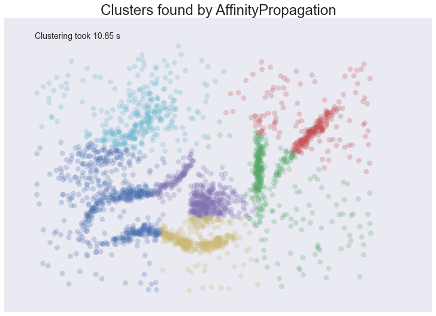
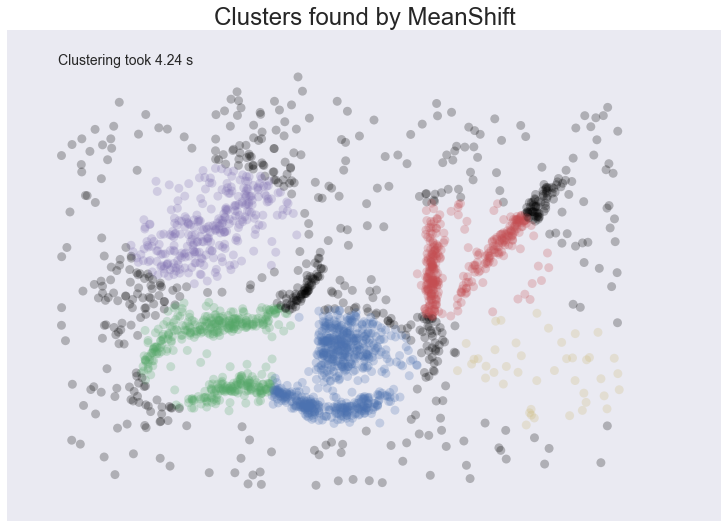
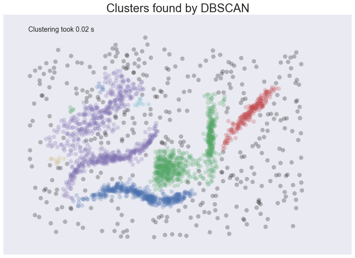

Comparing Python Clustering Algorithms
======================================

There are a lot of clustering algorithms to choose from. The standard
``sklearn`` clustering suite has thirteen different clustering classes
alone. So what clustering algorithms should you be using? As with every
question in data science and machine learning it depends on your data. A
number of those thirteen classes in ``sklearn`` are specialised for
certain tasks (such as co-clustering and bi-clustering, or clustering
features instead data points). Obviously an algorithm specializing in
text clustering is going to be the right choice for clustering text
data, and other algorithms specialize in other specific kinds of data.
Thus, if you know enough about your data, you can narrow down on the
clustering algorithm that best suits that kind of data, or the sorts of
important properties your data has, or the sorts of clustering you need
done. All well and good, but what if you don't know much about your
data? If, for example, you are 'just looking' and doing some exploratory
data analysis (EDA) it is not so easy to choose a specialized algorithm.
So, what algorithm is good for exploratory data analysis?

Some rules for EDA clustering
-----------------------------

To start, lets' lay down some ground rules of what we need a good EDA
clustering algorithm to do, then we can set about seeing how the
algorithms available stack up.

-  **Don't be wrong!**: If you are doing EDA you are trying to learn and
   gain intuitions about your data. In that case it is far better to get
   no result at all than a result that is wrong. Bad results lead to
   false intuitions which in turn send you down completely the wrong
   path. Not only do you not understand your data, you *misunderstand*
   your data. This means a good EDA clustering algorithm needs to
   conservative in int's clustering; it should be willing to not assign
   points to clusters; it should not group points together unless they
   really are in a cluster; this is true of far fewer algorithms than
   you might think.
-  **Intuitive Parameters**: All clustering algorithms have parameters;
   you need some knobs to turn to adjust things. The question is: how do
   you pick settings for those parameters? If you know little about your
   data it can be hard to determine what value or setting a parameter
   should have. This means parameters need to be intuitive enough that
   you can hopefully set them without having to know a lot about your
   data.
-  **Stable Clusters**: If you run the algorithm twice with a different
   random initialization, you should expect to get roughly the same
   clusters back. If you are sampling your data, taking a different
   random sample shouldn't radically change the resulting cluster
   structure (unless your sampling has problems). If you vary the
   clustering algorithm parameters you want the clustering to change in
   a somewhat stable predictable fashion.
-  **Performance**: Data sets are only getting bigger. You can
   sub-sample (but see *stability*), but ultimately you need a
   clustering algorithm that can scale to large data sizes. A clustering
   algorithm isn't much use if you can only use it if you take such a
   small sub-sample that it is no longer representative of the data at
   large!

There are other nice to have features like soft clusters, or overlapping
clusters, but the above desiderata is enough to get started with
because, oddly enough, very few clustering algorithms can satisfy them
all!

Getting set up
--------------

If we are going to compare clustering algorithms we'll need a few
things; first some libraries to load and cluster the data, and second
some visualisation tools so we can look at the results of clustering.

.. code:: python

    import numpy as np
    import matplotlib.pyplot as plt
    import seaborn as sns
    import sklearn.cluster as cluster
    import time
    %matplotlib inline
    sns.set_context('poster')
    sns.set_color_codes()
    plot_kwds = {'alpha' : 0.25, 's' : 80, 'linewidths':0}

Next we need some data. In order to make this more interesting I've
constructed an artificial dataset that will give clustering algorithms a
challenge -- some non-globular clusters, some noise etc.; the sorts of
things we expect to crop up in messy real-world data. So that we can
actually visualize clusterings the dataset is two dimensional; this is
not something we expect from real-world data where you generally can't
just visualize and see what is going on.

.. code:: python

    data = np.load('clusterable_data.npy')

So let's have a look at the data and see what we have.

.. code:: python

    plt.scatter(data.T[0], data.T[1], c='b', **plot_kwds)
    frame = plt.gca()
    frame.axes.get_xaxis().set_visible(False)
    frame.axes.get_yaxis().set_visible(False)





It's messy, but there are certainly some clusters that you can pick out
by eye; determining the exact boundaries of those clusters is harder of
course, but we can hope that our clustering algorithms will find at
least some of those clusters. So, on to testing ...

Testing Clustering Algorithms
-----------------------------

To start let's set up a little utility function to do the clustering and
plot the results for us. We can time the clustering algorithm while
we're at it and add that to the plot since we do care about performance.

.. code:: python

    def plot_clusters(data, algorithm, args, kwds):
        start_time = time.time()
        labels = algorithm(*args, **kwds).fit_predict(data)
        end_time = time.time()
        palette = sns.color_palette('deep', np.unique(labels).max() + 1)
        colors = [palette[x] if x >= 0 else (0.0, 0.0, 0.0) for x in labels]
        plt.scatter(data.T[0], data.T[1], c=colors, **plot_kwds)
        frame = plt.gca()
        frame.axes.get_xaxis().set_visible(False)
        frame.axes.get_yaxis().set_visible(False)
        plt.title('Clusters found by {}'.format(str(algorithm.__name__)), fontsize=24)
        plt.text(-0.5, 0.7, 'Clustering took {:.2f} s'.format(end_time - start_time), fontsize=14)

Before we try doing the clustering, there are some things to keep in
mind as we look at the results.

-  In real use cases we *can't* look at the data and realise points are
   not really in a cluster; we have to take the clustering algorithm at
   its word.
-  This is a small dataset, so poor performance here bodes very badly.

On to the clustering algorithms.

K-Means
-------

K-Means is the 'go-to' clustering algorithm for many simply because it
is fast, easy to understand, and available everywhere (there's an
implementation in almost any statistical or machine learning tool you
care to use). K-Means has a few problems however. The first is that it
isn't a clustering algorithm, it is a partitioning algorithm. That is to
say K-means doesn't 'find clusters' it partitions your dataset into as
many (assumed to be globular) chunks as you ask for by attempting to
minimize intra-partition distances. That leads to the second problem:
you need to specify exactly how many clusters you expect. If you know a
lot about your data then that is something you might expect to know. If,
on the other hand, you are simply exploring a new dataset then 'number
of clusters' is a hard parameter to have any good intuition for. The
usually proposed solution is to run K-Means for many different 'number
of clusters' values and score each clustering with some 'cluster
goodness' measure (usually a variation on intra-cluster vs inter-cluster
distances) and attempt to find an 'elbow'. If you've ever done this in
practice you know that finding said elbow is usually not so easy, nor
does it necessarily correlate as well with the actual 'natural' number
of clusters as you might like. Finally K-Means is also dependent upon
initialization; give it multiple different random starts and you can get
multiple different clusterings. This does not engender much confidence
in any individual clustering that may result.

So, in summary, here's how K-Means seems to stack up against out
desiderata: 
- **Don't be wrong!**: K-means is going to throw points
into clusters whether they belong or not; it also assumes you clusters
are globular. K-Means scores very poorly on this point.
- **Intuitive parameters**: If you have a good intuition for how many clusters the
dataset your exploring has then great, otherwise you might have a
problem. 
- **Stability**: Hopefully the clustering is stable for your
data. Best to have many runs and check though. 
- **Performance**: This is K-Means big win. It's a simple algorithm and with the right tricks
and optimizations can be made exceptionally efficient. There are few
algorithms that can compete with K-Means for performance. If you have
truly huge data then K-Means might be your only option.

But enough opinion, how does K-Means perform on our test dataset? Let's
have look. We'll be generous and use our knowledge that there are six
natural clusters and give that to K-Means.

.. code:: python

    plot_clusters(data, cluster.KMeans, (), {'n_clusters':6})





We see some interesting results. First, the assumption of perfectly
globular clusters means that the natural clusters have been spliced and
clumped into various more globular shapes. Worse, the noise points get
lumped into clusters as well: in some cases, due to where relative
cluster centers ended up, points very distant from a cluster get lumped
in. Having noise pollute your clusters like this is particularly bad in
an EDA world since they can easily mislead your intuition and
understanding of the data. On a more positive note we completed
clustering very quickly indeed, so at least we can be wrong quickly.

Affinity Propagation
--------------------

Affinity Propagation is a newer clustering algorithm that uses a graph
based approach to let points 'vote' on their preferred 'exemplar'. The
end result is a set of cluster 'exemplars' from which we derive clusters
by essentially doing what K-Means does and assigning each point to the
cluster of it's nearest exemplar. Affinity Propagation has some
advantages over K-Means. First of all the graph based exemplar voting
means that the user doesn't need to specify the number of clusters.
Second, due to how the algorithm works under the hood with the graph
representation it allows for non-metric dissimilarities (i.e. we can
have dissimilarities that don't obey the triangle inequality, or aren't
symmetric). This second point is important if you are ever working with
data isn't naturally embedded in a metric space of some kind; few
clustering algorithms support, for example, non-symmetric
dissimilarities. Finally Affinity Propagation does, at least, have
better stability over runs (but not over parameter ranges!).

The weak points of Affinity Propagation are similar to K-Means. Since it
partitions the data just like K-Means we expect to see the same sorts of
problems, particularly with noisy data. While Affinity Propagation
eliminates the need to specify the number of clusters, it has
'preference' and 'damping' parameters. Picking these parameters well can
be difficult. The implementation in ``sklearn`` default preference to
the median dissimilarity. This tends to result in a very large number of
clusters. A better value is something smaller (or negative) but data
dependent. Finally Affinity Propagation is *slow*; since it supports
non-metric dissimilarities it can't take any of the shortcuts available
to other algorithms, and the basic operations are expensive as data size
grows.

So, in summary, over our desiderata we have:

-  **Don't be wrong**: The same issues as K-Means; Affinity Propagation
   is going to throw points into clusters whether they belong or not; it
   also assumes you clusters are globular.
-  **Intuitive Parameters**: It can be easier to guess at preference and
   damping than number of clusters, but since Affinity Propagation is
   quite sensitive to preference values it can be fiddly to get "right".
   This isn't really that much of an improvement over K-Means.
-  **Stability**: Affinity Propagation is deterministic over runs.
-  **Performance**: Affinity Propagation tends to be very slow. In
   practice running it on large datasets is essentially impossible
   without a carefully crafted and optimized implementation (i.e. not
   the default one available in ``sklearn``).

And how does it look in practice on our chosen dataset? I've tried to
select a preference and damping value that gives a reasonable number of
clusters (in this case six) but feel free to play with the parameters
yourself and see if you can come up with a better clustering.

.. code:: python

    plot_clusters(data, cluster.AffinityPropagation, (), {'preference':-5.0, 'damping':0.95})





The result is eerily similar to K-Means and has all the same problems.
The globular clusters have lumped together splied parts of various
'natural' clusters. The noise points have been assigned to clusters
regardless of being significant outliers. In other words, we'll have a
very poor intuitive understanding of our data based on these 'clusters'.
Worse still it took us several seconds to arrive at this unenlightening
conclusion.

Mean Shift
----------

Mean shift is another option if you don't want to have to specify the
number of clusters. It is centroid based, like K-Means and affinity
propagation, but can return clusters instead of a partition. The
underlying idea of the Mean Shift algorithm is that there exists some
probability density function from which the data is drawn, and tries to
place centroids of clusters at the maxima of that density function. It
approximates this via kernel density estimation techniques, and the key
parameter is then the bandwidth of the kernel used. This is easier to
guess than the number of clusters, but may require some staring at, say,
the distributions of pairwise distances between data points to choose
successfully. The other issue (at least with the sklearn implementation)
is that it is fairly slow depsite potentially having good scaling!

How does Mean Shift fare against out criteria? In principle proming, but
in practice ...

-  **Don't be wrong!**: Mean Shift doesn't cluster every point, but it
   still aims for globular clusters, and in practice it can return less
   than ideal results (see below for example). Without visual validation
   it can be hard to know how wrong it may be.
-  **Intuitive parameters**: Mean Shift has more intuitive and
   meaningful parameters; this is certainly a strength.
-  **Stability**: Mean Shift results can vary a lot as you vary the
   bandwidth parameter (which can make selection more difficult than it
   first appears. It also has a random initialisation, which means
   stability under runs can vary (if you reseed the random start).
-  **Performance**: While Mean Shift has good scalability in principle
   (using ball trees) in practice the sklearn implementation is slow;
   this is a serious weak point for Mean Shift.

Let's see how it works on some actual data. I spent a while trying to
find a good bandwidth value that resulted in a reasonable clustering.
The choice below is about the best I found.

.. code:: python

    plot_clusters(data, cluster.MeanShift, (0.175,), {'cluster_all':False})





We at least aren't polluting our clusters with as much noise, but we
certainly have dense regions left as noise and clusters that run across
and split what seem like natural clusters. There is also the outlying
yellow cluster group that doesn't make a lot of sense. Thus while Mean
Shift had good promise, and is certainly better than K-Means, it's still
short of our desiderata. Worse still it took over 4 seconds to cluster
this small dataset!

Spectral Clustering
-------------------

Spectral clustering can best be thought of as a graph clustering. For
spatial data one can think of inducing a graph based on the distances
between points (potentially a k-NN graph, or even a dense graph). From
there spectral clustering will look at the eigenvectors of the Laplacian
of the graph to attempt to find a good (low dimensional) embedding of
the graph into Euclidean space. This is essentially a kind of manifold
learning, finding a transformation of our original space so as to better
represent manifold distances for some manifold that the data is assumed
to lie on. Once we have the transformed space a standard clustering
algorithm is run; with ``sklearn`` the default is K-Means. That means
that the key for spectral clustering is the transformation of the space.
Presuming we can better respect the manifold we'll get a better
clustering -- we need worry less about K-Means globular clusters as they
are merely globular on the transformed space and not the original space.
We unfortunately retain some of K-Means weaknesses: we still partition
the data instead of clustering it; we have the hard to guess 'number of
clusters' parameter; we have stability issues inherited from K-Means.
Worse, if we operate on the dense graph of the distance matrix we have a
very expensive initial step and sacrifice performance.

So, in summary:

-  **Don't be wrong!**: We are less wrong, in that we don't have a
   purely globular cluster assumption; we do still have partitioning and
   hence are polluting clusters with noise, messing with our
   understanding of the clusters and hence the data.
-  **Intuitive parameters**: We are no better than K-Means here; we have
   to know the correct number of clusters, or hope to guess by
   clustering over a range of parameter values and finding some way to
   pick the 'right one'.
-  **Stability**: Slightly more stable than K-Means due to the
   transformation, but we still suffer from those issues.
-  **Performance**: For spatial data we don't have a sparse graph
   (unless we prep one ourselves) so the result is a somewhat slower
   algorithm.

Let's have a look at how it operates on our test dataset. Again, we'll
be generous and give it the six clusters to look for.

.. code:: python

    plot_clusters(data, cluster.SpectralClustering, (), {'n_clusters':6})


.. image:: images/comparing_clustering_algorithms_21_0.png


Spectral clustering performed *better* on the long thin clusters, but
still ended up cutting some of them strangely and dumping parts of them
in with other clusters. We also still have the issue of noise points
polluting our clusters, so again our intuitions are going to be led
astray. Performance was a distinct improvement of Affinity Propagation
however. Over all we are doing better, but are still a long way from
achieving our desiderata.

Agglomerative Clustering
------------------------

Agglomerative clustering is really a suite of algorithms all based on
the same idea. The fundamental idea is that you start with each point in
it's own cluster and then, for each cluster, use some criterion to
choose another cluster to merge with. Do this repeatedly until you have
only one cluster and you get get a hierarchy, or binary tree, of
clusters branching down to the last layer which has a leaf for each
point in the dataset. The most basic version of this, single linkage,
chooses the closest cluster to merge, and hence the tree can be ranked
by distance as to when clusters merged/split. More complex variations
use things like mean distance between clusters, or distance between
cluster centroids etc. to determine which cluster to merge. Once you
have a cluster hierarchy you can choose a level or cut (according to
some criteria) and take the clusters at that level of the tree. For
``sklearn`` we usually choose a cut based on a 'number of clusters'
parameter passed in.

The advantage of this approach is that clusters can grow 'following the
underlying manifold' rather than being presumed to be globular. You can
also inspect the dendrogram of clusters and get more information about
how clusters break down. On the other hand, if you want a flat set of
clusters you need to choose a cut of the dendrogram, and that can be
hard to determine. You can take the ``sklearn`` approach and specify a
number of clusters, but as we've already discussed that isn't a
particularly intuitive parameter when you're doing EDA. You can look at
the dendrogram and try to pick a natural cut, but this is similar to
finding the 'elbow' across varying ``k`` values for K-Means: in
principle it's fine, and the textbook examples always make it look easy,
but in practice on messy real world data the 'obvious' choice is often
far from obvious. We are also still partitioning rather than clustering
the data, so we still have that persistent issue of noise polluting our
clusters. Fortunately performance can be pretty good; the ``sklearn``
implementation is fairly slow, but
```fastcluster`` <https://pypi.python.org/pypi/fastcluster>`__ provides
high performance agglomerative clustering if that's what you need.

So, in summary:

-  **Don't be wrong!**: We have gotten rid of the globular assumption,
   but we are still assuming that all the data belongs in clusters with
   no noise.
-  **Intuitive parameters**: Similar to K-Means we are stuck choosing
   the number of clusters (not easy in EDA), or trying to discern some
   natural parameter value from a plot that may or may not have any
   obvious natural choices.
-  **Stability**: Agglomerative clustering is stable across runs and the
   dendrogram shows how it varies over parameter choices (in a
   reasonably stable way), so stability is a strong point.
-  **Performance**: Performance can be good if you get the right
   implementation.

So, let's see it clustering data. I chose to provide the correct number
of clusters (six) and use Ward as the linkage/merge method. This is a
more robust method than say single linkage, but it does tend toward more
globular clusters.

.. code:: python

    plot_clusters(data, cluster.AgglomerativeClustering, (), {'n_clusters':6, 'linkage':'ward'})


.. image:: images/comparing_clustering_algorithms_24_0.png


Similar to the spectral clustering we have handled the long thin
clusters much better than K-Means or Affinity Propagation. We in fact
improved on spectral clustering a bit on that front. We do still have
clusters that contain parts of several different natural clusters, but
those 'mis-clusterings' are smaller. We also still have all the noise
points polluting our clusters. The end result is probably the best
clustering we've seen so far, but given the mis-clustering and noise
issues we are still not going to get as good an intuition for the data
as we might reasonably hope for.

DBSCAN
------

DBSCAN is a density based algorithm -- it assumes clusters for dense
regions. It is also the first actual clustering algorithm we've looked
at: it doesn't require that every point be assigned to a cluster and
hence doesn't partition the data, but instead extracts the 'dense'
clusters and leaves sparse background classified as 'noise'. In practice
DBSCAN is related to agglomerative clustering. As a first step DBSCAN
transforms the space according to the density of the data: points in
dense regions are left alone, while points in sparse regions are moved
further away. Applying single linkage clustering to the transformed
space results in a dendrogram, which we cut according to a distance
parameter (called epsilon or ``eps`` in many implementations) to get
clusters. Importantly any singleton clusters at that cut level are
deemed to be 'noise' and left unclustered. This provides several
advantages: we get the manifold following behaviour of agglomerative
clustering, and we get actual clustering as opposed to partitioning.
Better yet, since we can frame the algorithm in terms of local region
queries we can use various tricks such as kdtrees to get exceptionally
good performance and scale to dataset sizes that are otherwise
unapproachable with algorithms other than K-Means. There are some
catches however. Obviously epsilon can be hard to pick; you can do some
data analysis and get a good guess, but the algorithm can be quite
sensitive to the choice of the parameter. The density based
transformation depends on another parameter (``min_samples`` in
``sklearn``). Finally the combination of ``min_samples`` and ``eps``
amounts to a choice of density and the clustering only finds clusters at
or above that density; if your data has variable density clusters then
DBSCAN is either going to miss them, split them up, or lump some of them
together depending on your parameter choices.

So, in summary:

-  **Don't be wrong!**: Clusters don't need to be globular, and won't
   have noise lumped in; varying density clusters may cause problems,
   but that is more in the form of insufficient detail rather than
   explicitly wrong. DBSCAN is the first clustering algorithm we've
   looked at that actually meets the 'Don't be wrong!' requirement.
-  **Intuitive parameters**: Epsilon is a distance value, so you can
   survey the distribution of distances in your dataset to attempt to
   get an idea of where it should lie. In practice, however, this isn't
   an especially intuitive parameter, nor is it easy to get right.
-  **Stability**: DBSCAN is stable across runs (and to some extent
   subsampling if you re-parameterize well); stability over varying
   epsilon and min samples is not so good.
-  **Performance**: This is DBSCAN's other great strength; few
   clustering algorithms can tackle datasets as large as DBSCAN can.

So how does it cluster our test dataset? I played with a few epsilon
values until I got somethign reasonable, but there was little science to
this -- getting the parameters right can be hard.

.. code:: python

    plot_clusters(data, cluster.DBSCAN, (), {'eps':0.025})





This is a pretty decent clustering; we've lumped natural clusters
together a couple of times, but at least we didn't carve them up to do
so. We also picked up a few tiny clusters in amongst the large sparse
cluster. These problems are artifacts of not handling variable density
clusters -- to get the sparser clusters to cluster we end up lumping
some of the denser clusters with them; in the meantime the very sparse
cluster is still broken up into several clusters. All in all we're
finally doing a decent job, but there's still plenty of room for
improvement.

HDBSCAN
-------

HDBSCAN is a recent algorithm developed by some of the same people who
write the original DBSCAN paper. Their goal was to allow varying density
clusters. The algorithm starts off much the same as DBSCAN: we transform
the space according to density, exactly as DBSCAN does, and perform
single linkage clustering on the transformed space. Instead of taking an
epsilon value as a cut level for the dendrogram however, a different
approach is taken: the dendrogram is condensed by viewing splits that
result in a small number of points splitting off as points 'falling out
of a cluster'. This results in a smaller tree with fewer clusters that
'lose points'. That tree can then be used to select the most stable or
persistent clusters. This process allows the tree to be cut at varying
height, picking our varying density clusters based on cluster stability.
The immediate advantage of this is that we can have varying density
clusters; the second benefit is that we have eliminated the epsilon
parameter as we no longer need it to choose a cut of the dendrogram.
Instead we have a new parameter ``min_cluster_size`` which is used to
determine whether points are 'falling out of a cluster' or splitting to
form two new clusters. This trades an unintuitive parameter for one that
is not so hard to choose for EDA (what is the minimum size cluster I am
willing to care about?).

So, in summary:

-  **Don't be wrong!**: We inherited all the benefits of DBSCAN and
   removed the varying density clusters issue. HDBSCAN is easily the
   strongest option on the 'Don't be wrong!' front.
-  **Intuitive parameters**: Choosing a mimnimum cluster size is very
   reasonable. The only remaining parameter is ``min_samples`` inherited
   from DBSCAN for the density based space transformation. Sadly
   ``min_samples`` is not that intuitive; HDBSCAN is not that sensitive
   to it and we can choose some sensible defaults, but this remains the
   biggest weakness of the algorithm.
-  **Stability**: HDBSCAN is stable over runs and subsampling (since the
   variable density clustering will still cluster sparser subsampled
   clusters with the same parameter choices), and has good stability
   over parameter choices.
-  **Performance**: When implemented well HDBSCAN can be very efficient.
   The current implementation has similar performance to
   ``fastcluster``'s agglomerative clustering (and will use
   ``fastcluster`` if it is available), but we expect future
   implementations that take advantage of newer data structure such as
   cover trees to scale significantly better.

How does HDBSCAN perform on our test dataset? Unfortunately HDBSCAN is
not part of ``sklearn``. Fortunately we can just import the `hdbscan
library <https://github.com/scikit-learn-contrib/hdbscan>`__ and use it as if it
were part of ``sklearn``.

.. code:: python

    import hdbscan

.. code:: python

    plot_clusters(data, hdbscan.HDBSCAN, (), {'min_cluster_size':15})


.. image:: images/comparing_clustering_algorithms_31_0.png


I think the picture speaks for itself.

