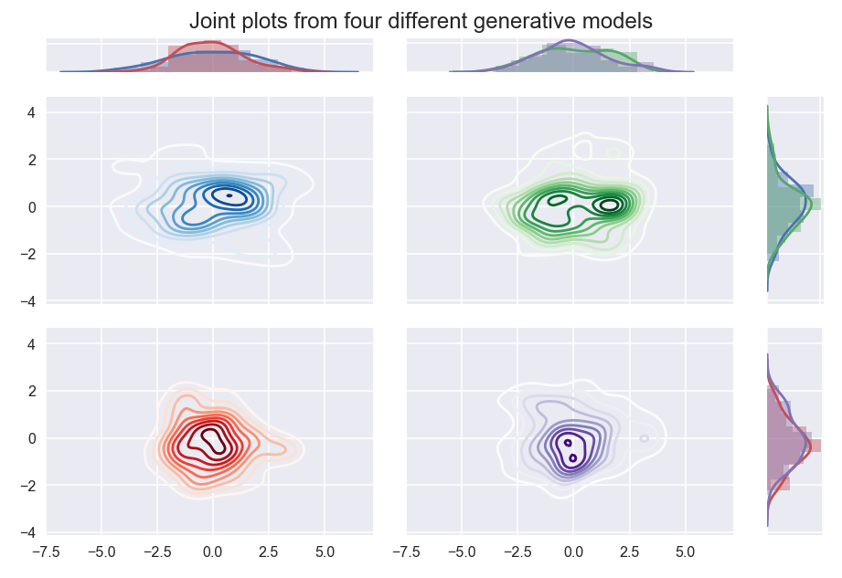

Frequently Asked Questions
==========================

Here we attempt to address some common questions, directing the user to some
helpful answers.

Q: Most of data is classified as noise; why?
--------------------------------------------

The amount of data classified as noise is controlled by the ``min_samples``
parameter. By default, if not otherwise set, this value is set to the same
value as ``min_cluster_size``. You can set it independently if you wish by
specifying it separately. The lower the value, the less noise you'll get, but
there are limits, and it is possible that you simply have noisy data. See
:any:`_min_samples_label` for more details.

Q: I mostly just get one large cluster; I want smaller clusters.
----------------------------------------------------------------

If you are getting a single large cluster and a few small outlying clusters
that means your data is essentially a large glob with some small outlying
clusters -- there may be structure to the glob, but compared to how well
separated those other small clusters are, it doesn't really show up. You may,
however, want to get at that more fine grained structure. You can do that,
and what you are looking for is leaf clustering :any:`_leaf_cluster_label` .

Q: HDBSCAN is failing to separate the clusters I think it should.
-----------------------------------------------------------------

Density based clustering relies on having enough data to separate dense areas.
In higher dimensional spaces this becomes more difficult, and hence
requires more data. Quite possibly there is not enough data to make your
clusters clearly separable. Consider the following plots:

.. image:: images/generative_model_scatter.png

Four different generative models, when sampled, produce results that are hard to
easily differentiate. The blue dataset is sampled from a mixture of three
standard Gaussians centered at (-2, 0), (0,0) and (2,0); the green dataset is
sampled from a mixture of two standard Gaussians centered at (-1,0) and (1,0);
the red data is sampled from a multivariate Gaussian with covariance
[2, 0; 0, 1]; the purple data is a single standard Gaussian with uniform
background noise.

Despite the generate model having clearly different "clusters", without more
data we simply cannot differentiate between these models, and hence no
density based clustering will manage cluster these according to the model.

Q: I am not getting the claimed performance. Why not?
-----------------------------------------------------

The most likely explanation is to do with the dimensionality of your input data.
While HDBSCAN can perform well on low to medium dimensional data the performance
tends to decrease significantly as dimension increases. In general HDBSCAN can do
well on up to around 50 or 100 dimensional data, but performance can see 
significant decreases beyond that. Of course a lot is also dataset dependent, so 
you can still get good performance even on high dimensional data, but it
is no longer guaranteed.

Q: I want to predict the cluster of a new unseen point. How do I do this?
-------------------------------------------------------------------------

This is possible via the function :func:`~hdbscan.prediction.approximate_predict`. Note that you
either need to set ``prediction_data=True`` on initialization of your
clusterer object, or run the ``generate_prediction_data`` method after
fitting. With that done you can run :func:`~hdbscan.prediction.approximate_predict` with the model
and any new data points you wish to predict. Note that this differs from
re-running HDBSCAN with the new points added since no new clusters will be
considered -- instead the new points will be labelled according to the
clusters already labelled by the model.

Q: Haversine metric is not clustering my Lat-Lon data correctly.
----------------------------------------------------------------

The Haversine metric as implemented supports coordinates in radians. That
means you'll need to convert your latitude and longitude data into radians
before passing it in to HDBSCAN.

Q: I want to cite this software in my journal publication. How do I do that?
----------------------------------------------------------------------------

If you have used this codebase in a scientific publication and wish to cite it, please use the `Journal of Open Source Software article <http://joss.theoj.org/papers/10.21105/joss.00205>`_.

    L. McInnes, J. Healy, S. Astels, *hdbscan: Hierarchical density based clustering* 
    In: Journal of Open Source Software, The Open Journal, volume 2, number 11. 
    2017
    
BibTeX::
    
    @article{McInnes2017,
      doi = {10.21105/joss.00205},
      url = {https://doi.org/10.21105%2Fjoss.00205},
      year  = {2017},
      month = {mar},
      publisher = {The Open Journal},
      volume = {2},
      number = {11},
      author = {Leland McInnes and John Healy and Steve Astels},
      title = {hdbscan: Hierarchical density based clustering},
      journal = {The Journal of Open Source Software}
    }
    
::
