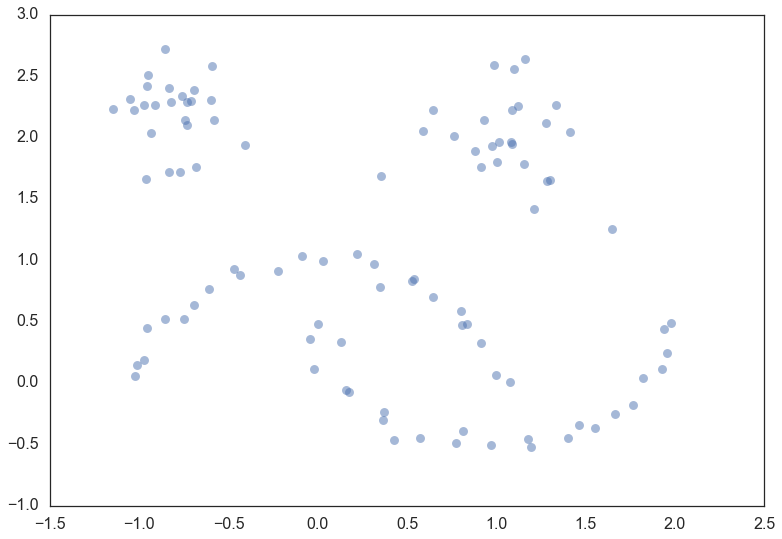
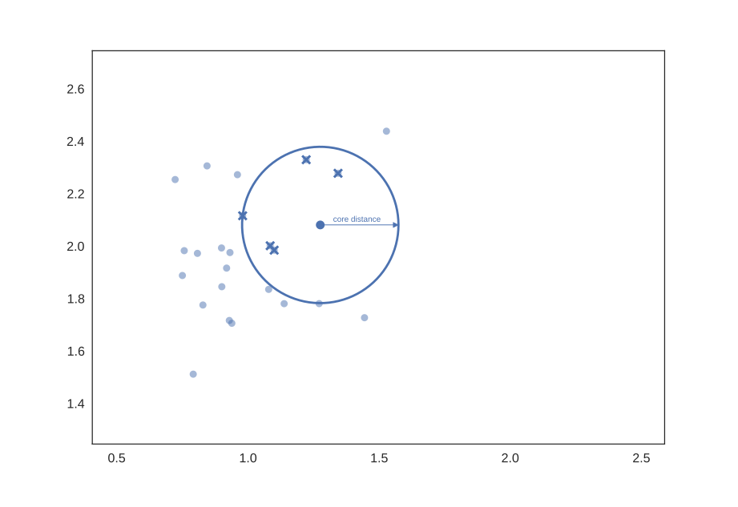
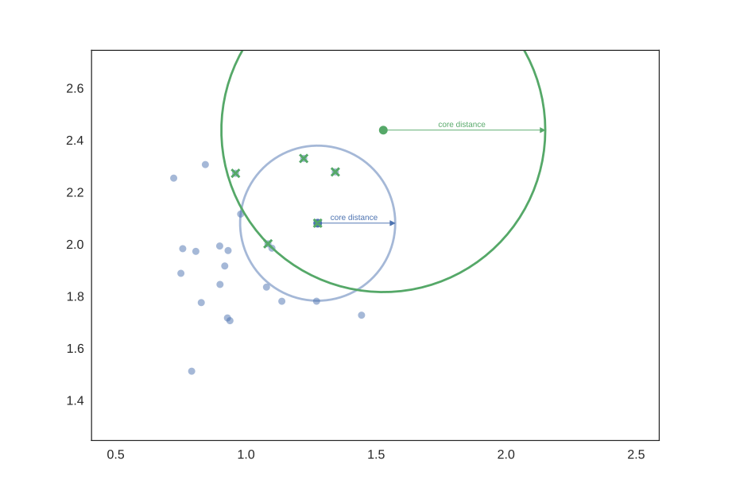
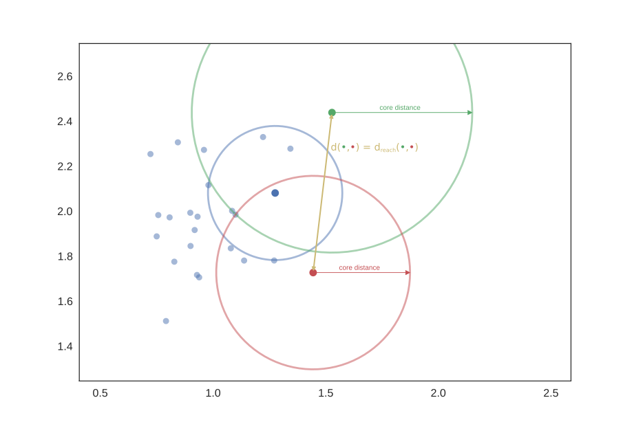
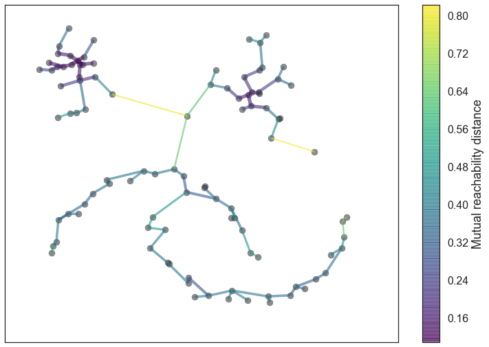
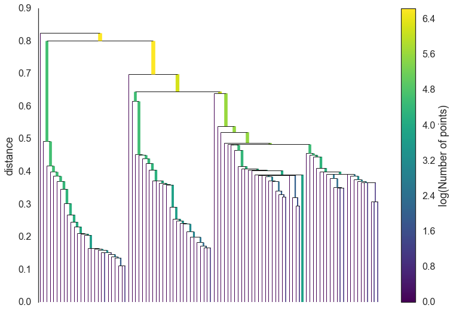
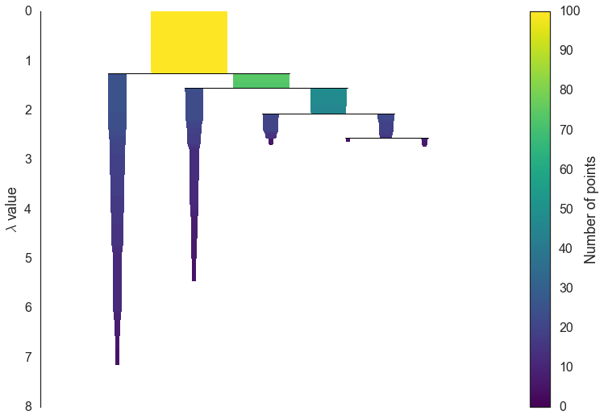
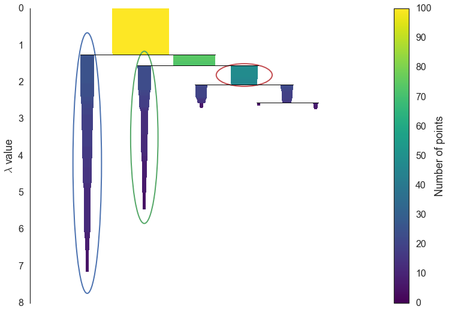
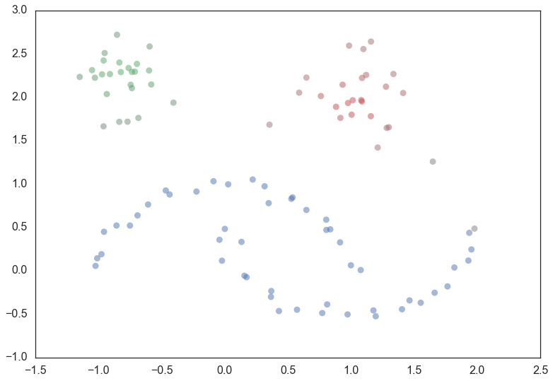

How HDBSCAN Works
=================

HDBSCAN is a clustering algorithm developed by `Campello, Moulavi, and
Sander <http://link.springer.com/chapter/10.1007%2F978-3-642-37456-2_14>`__.
It extends DBSCAN by converting it into a hierarchical clustering
algorithm, and then using a technique to extract a flat clustering based
in the stability of clusters. The goal of this notebook is to give you
an overview of how the algorithm works and the motivations behind it. In
contrast to the HDBSCAN paper I'm going to describe it without reference
to DBSCAN. Instead I'm going to explain how I like to think about the
algorithm, which aligns more closely with `Robust Single
Linkage <http://cseweb.ucsd.edu/~dasgupta/papers/tree.pdf>`__ with `flat
cluster
extraction <http://link.springer.com/article/10.1007%2Fs10618-013-0311-4>`__
on top of it.

Before we get started we'll load up most of the libraries we'll need in
the background, and set up our plotting (because I believe the best way
to understand what is going on is to actually see it working in
pictures).

.. code:: python

    import numpy as np
    import matplotlib.pyplot as plt
    import seaborn as sns
    import sklearn.datasets as data
    %matplotlib inline
    sns.set_context('poster')
    sns.set_style('white')
    sns.set_color_codes()
    plot_kwds = {'alpha' : 0.5, 's' : 80, 'linewidths':0}

The next thing we'll need is some data. To make for an illustrative
example we'll need the data size to be fairly small so we can see what
is going on. It will also be useful to have several clusters, preferably
of different kinds. Fortunately sklearn has facilities for generating
sample clustering data so I'll make use of that and make a dataset of
one hundred data points.

.. code:: python

    moons, _ = data.make_moons(n_samples=50, noise=0.05)
    blobs, _ = data.make_blobs(n_samples=50, centers=[(-0.75,2.25), (1.0, 2.0)], cluster_std=0.25)
    test_data = np.vstack([moons, blobs])
    plt.scatter(test_data.T[0], test_data.T[1], color='b', **plot_kwds)

Now, the best way to explain HDBSCAN is actually just use it and then go
through the steps that occurred along the way teasing out what is
happening at each step. So let's load up the `hdbscan
library <https://github.com/scikit-learn-contrib/hdbscan>`__ and get to work.

.. code:: python

    import hdbscan

.. code:: python

    clusterer = hdbscan.HDBSCAN(min_cluster_size=5, gen_min_span_tree=True)
    clusterer.fit(test_data)

.. parsed-literal::

    HDBSCAN(algorithm='best', alpha=1.0, approx_min_span_tree=True,
        gen_min_span_tree=True, leaf_size=40, memory=Memory(cachedir=None),
        metric='euclidean', min_cluster_size=5, min_samples=None, p=None)

So now that we have clustered the data -- what actually happened? We can
break it out into a series of steps

1. Transform the space according to the density/sparsity.
2. Build the minimum spanning tree of the distance weighted graph.
3. Construct a cluster hierarchy of connected components.
4. Condense the cluster hierarchy based on minimum cluster size.
5. Extract the stable clusters from the condensed tree.

Transform the space
-------------------

To find clusters we want to find the islands of higher density amid a
sea of sparser noise -- and the assumption of noise is important: real
data is messy and has outliers, corrupt data, and noise. The core of the
clustering algorithm is single linkage clustering, and it can be quite
sensitive to noise: a single noise data point in the wrong place can act
as a bridge between islands, gluing them together. Obviously we want our
algorithm to be robust against noise so we need to find a way to help
'lower the sea level' before running a single linkage algorithm.

How can we characterize 'sea' and 'land' without doing a clustering? As
long as we can get an estimate of density we can consider lower density
points as the 'sea'. The goal here is not to perfectly distinguish 'sea'
from 'land' -- this is an initial step in clustering, not the ouput --
just to make our clustering core a little more robust to noise. So given
an identification of 'sea' we want to lower the sea level. For practical
purposes that means making 'sea' points more distant from each other and
from the 'land'.

That's just the intuition however. How does it work in practice? We need
a very inexpensive estimate of density, and the simplest is the distance
to the *k*\ th nearest neighbor. If we have the distance matrix for our
data (which we will need imminently anyway) we can simply read that off;
alternatively if our metric is supported (and dimension is low) this is
the sort of query that
`kd-trees <http://scikit-learn.org/stable/modules/neighbors.html#k-d-tree>`__
are good for. Let's formalise this and (following the DBSCAN, LOF, and
HDBSCAN literature) call it the **core distance** defined for parameter
*k* for a point *x* and denote as :math:`\mathrm{core}_k(x)`. Now we
need a way to spread apart points with low density (correspondingly high
core distance). The simple way to do this is to define a new distance
metric between points which we will call (again following the
literature) the **mutual reachability distance**. We define mutual
reachability distance as follows:

.. raw:: html

   

:math:`d_{\mathrm{mreach-}k}(a,b) = \max \{\mathrm{core}_k(a), \mathrm{core}_k(b), d(a,b) \}`

.. raw:: html

   

where :math:`d(a,b)` is the original metric distance between *a* and
*b*. Under this metric dense points (with low core distance) remain the
same distance from each other but sparser points are pushed away to be
at least their core distance away from any other point. This effectively
'lowers the sea level' spreading sparse 'sea' points out, while leaving
'land' untouched. The caveat here is that obviously this is dependent
upon the choice of *k*; larger *k* values interpret more points as being
in the 'sea'. All of this is a little easier to understand with a
picture, so let's use a *k* value of five. Then for a given point we can
draw a circle for the core distance as the circle that touches the sixth
nearest neighbor (counting the point itself), like so:

Pick another point and we can do the same thing, this time with a
different set of neighbors (one of them even being the first point we
picked out).

And we can do that a third time for good measure, with another set of
six nearest neighbors and another circle with slightly different radius
again.

.. image:: images/distance3.svg

Now if we want to know the mutual reachability distance between the
blue and green points we can start by drawing in an arrow giving the
distance between green and blue:

.. image:: images/distance4.svg

This passes through the blue circle, but not the green circle -- the
core distance for green is larger than the distance between blue and
green. Thus we need to mark the mutual reachability distance between
blue and green as larger -- equal to the radius of the green circle
(easiest to picture if we base one end at the green point).

.. image:: images/distance4a.svg

On the other hand the mutual reachablity distance from red to green is
simply distance from red to green since that distance is greater than
either core distance (i.e. the distance arrow passes through both
circles).

In general there is `underlying
theory <http://arxiv.org/pdf/1506.06422v2.pdf>`__ to demonstrate that
mutual reachability distance as a transform works well in allowing
single linkage clustering to more closely approximate the hierarchy of
level sets of whatever true density distribution our points were sampled
from.

Build the minimum spanning tree
-------------------------------

Now that we have a new mutual reachability metric on the data we want
start finding the islands on dense data. Of course dense areas are
relative, and different islands may have different densities.
Conceptually what we will do is the following: consider the data as a
weighted graph with the data points as vertices and an edge between any
two points with weight equal to the mutual reachability distance of
those points.

Now consider a threshold value, starting high, and steadily being
lowered. Drop any edges with weight above that threshold. As we drop
edges we will start to disconnect the graph into connected components.
Eventually we will have a hierarchy of connected components (from
completely connected to completely disconnected) at varying threshold
levels.

In practice this is very expensive: there are :math:`n^2` edges and we
don't want to have to run a connected components algorithm that many
times. The right thing to do is to find a minimal set of edges such that
dropping any edge from the set causes a disconnection of components. But
we need more, we need this set to be such that there is no lower weight
edge that could connect the components. Fortunately graph theory
furnishes us with just such a thing: the minimum spanning tree of the
graph.

We can build the minimum spanning tree very efficiently via `Prim's
algorithm <https://en.wikipedia.org/wiki/Prim%27s_algorithm>`__ -- we
build the tree one edge at a time, always adding the lowest weight edge
that connects the current tree to a vertex not yet in the tree. You can
see the tree HDBSCAN constructed below; note that this is the minimum
spanning tree for *mutual reachability distance* which is different from
the pure distance in the graph. In this case we had a *k* value of 5.

In the case that the data lives in a metric space we can use even faster
methods, such as Dual Tree Boruvka to build the minimal spanning tree.

.. code:: python

    clusterer.minimum_spanning_tree_.plot(edge_cmap='viridis', 
                                          edge_alpha=0.6, 
                                          node_size=80, 
                                          edge_linewidth=2)

Build the cluster hierarchy
---------------------------

Given the minimal spanning tree, the next step is to convert that into
the hierarchy of connected components. This is most easily done in the
reverse order: sort the edges of the tree by distance (in increasing
order) and then iterate through, creating a new merged cluster for each
edge. The only difficult part here is to identify the two clusters each
edge will join together, but this is easy enough via a
`union-find <https://en.wikipedia.org/wiki/Disjoint-set_data_structure>`__
data structure. We can view the result as a dendrogram as we see below:

.. code:: python

    clusterer.single_linkage_tree_.plot(cmap='viridis', colorbar=True)

This brings us to the point where robust single linkage stops. We want
more though; a cluster hierarchy is good, but we really want a set of
flat clusters. We could do that by drawing a a horizontal line through
the above diagram and selecting the clusters that it cuts through. This
is in practice what
`DBSCAN <http://scikit-learn.org/stable/modules/clustering.html#dbscan>`__
effectively does (declaring any singleton clusters at the cut level as
noise). The question is, how do we know where to draw that line? DBSCAN
simply leaves that as a (very unintuitive) parameter. Worse, we really
want to deal with variable density clusters and any choice of cut line
is a choice of mutual reachability distance to cut at, and hence a
single fixed density level. Ideally we want to be able to cut the tree
at different places to select our clusters. This is where the next steps
of HDBSCAN begin and create the difference from robust single linkage.

Condense the cluster tree
-------------------------

The first step in cluster extraction is condensing down the large and
complicated cluster hierarchy into a smaller tree with a little more
data attached to each node. As you can see in the hierarchy above it is
often the case that a cluster split is one or two points splitting off
from a cluster; and that is the key point -- rather than seeing it as a
cluster splitting into two new clusters we want to view it as a single
persistent cluster that is 'losing points'. To make this concrete we
need a notion of **minimum cluster size** which we take as a parameter
to HDBSCAN. Once we have a value for minimum cluster size we can now
walk through the hierarchy and at each split ask if one of the new
clusters created by the split has fewer points than the minimum cluster
size. If it is the case that we have fewer points than the minimum
cluster size we declare it to be 'points falling out of a cluster' and
have the larger cluster retain the cluster identity of the parent,
marking down which points 'fell out of the cluster' and at what distance
value that happened. If on the other hand the split is into two clusters
each at least as large as the minimum cluster size then we consider that
a true cluster split and let that split persist in the tree. After
walking through the whole hierarchy and doing this we end up with a much
smaller tree with a small number of nodes, each of which has data about
how the size of the cluster at that node decreases over varying
distance. We can visualize this as a dendrogram similar to the one above
-- again we can have the width of the line represent the number of
points in the cluster. This time, however, that width varies over the
length of the line as points fall out of the cluster. For our data using
a minimum cluster size of 5 the result looks like this:

.. code:: python

    clusterer.condensed_tree_.plot()

This is much easier to look at and deal with, particularly in as simple
a clustering problem as our current test dataset. However we still need
to pick out clusters to use as a flat clustering. Looking at the plot
above should give you some ideas about how one might go about doing
this.

Extract the clusters
--------------------

Intuitively we want the choose clusters that persist and have a longer
lifetime; short lived clusters are probably merely artifacts
of the single linkage approach. Looking at the previous plot we could
say that we want to choose those clusters that have the greatest area of
ink in the plot. To make a flat clustering we will need to add a further
requirement that, if you select a cluster, then you cannot select any
cluster that is a descendant of it. And in fact that intuitive notion of
what should be done is exactly what HDBSCAN does. Of course we need to
formalise things to make it a concrete algorithm.

First we need a different measure than distance to consider the
persistence of clusters; instead we will use
:math:`\lambda = \frac{1}{\mathrm{distance}}`. For a given cluster we
can then define values :math:`\lambda_{\mathrm{birth}}` and
:math:`\lambda_{\mathrm{death}}` to be the lambda value when the cluster
split off and became it's own cluster, and the lambda value (if any)
when the cluster split into smaller clusters respectively. In turn, for
a given cluster, for each point *p* in that cluster we can define the
value :math:`\lambda_p` as the lambda value at which that point 'fell
out of the cluster' which is a value somewhere between
:math:`\lambda_{\mathrm{birth}}` and :math:`\lambda_{\mathrm{death}}`
since the point either falls out of the cluster at some point in the
cluster's lifetime, or leaves the cluster when the cluster splits into
two smaller clusters. Now, for each cluster compute the **stability**
as

:math:`\sum_{p \in \mathrm{cluster}} (\lambda_p - \lambda_{\mathrm{birth}})`.

Declare all leaf nodes to be selected clusters. Now work up through the
tree (the reverse topological sort order). If the sum of the stabilities
of the child clusters is greater than the stability of the cluster, then
we set the cluster stability to be the sum of the child stabilities. If,
on the other hand, the cluster's stability is greater than the sum of
its children then we declare the cluster to be a selected cluster and
unselect all its descendants. Once we reach the root node we call the
current set of selected clusters our flat clustering and return that.

Okay, that was wordy and complicated, but it really is simply performing
our 'select the clusters in the plot with the largest total ink area'
subject to descendant constraints that we explained earlier. We can
select the clusters in the condensed tree dendrogram via this algorithm,
and you get what you expect:

.. code:: python

    clusterer.condensed_tree_.plot(select_clusters=True, selection_palette=sns.color_palette())

Now that we have the clusters it is a simple enough matter to turn that
into cluster labelling as per the sklearn API. Any point not in a
selected cluster is simply a noise point (and assigned the label -1). We
can do a little more though: for each cluster we have the
:math:`\lambda_p` for each point *p* in that cluster; If we simply
normalize those values (so they range from zero to one) then we have a
measure of the strength of cluster membership for each point in the
cluster. The hdbscan library returns this as a ``probabilities_``
attribute of the clusterer object. Thus, with labels and membership
strengths in hand we can make the standard plot, choosing a color for
points based on cluster label, and desaturating that color according the
strength of membership (and make unclustered points pure gray).

.. code:: python

    palette = sns.color_palette()
    cluster_colors = [sns.desaturate(palette[col], sat) 
                      if col >= 0 else (0.5, 0.5, 0.5) for col, sat in 
                      zip(clusterer.labels_, clusterer.probabilities_)]
    plt.scatter(test_data.T[0], test_data.T[1], c=cluster_colors, **plot_kwds)

And that is how HDBSCAN works. It may seem somewhat complicated -- there
are a fair number of moving parts to the algorithm -- but ultimately
each part is actually very straightforward and can be optimized well.
Hopefully with a better understanding both of the intuitions and some of
the implementation details of HDBSCAN you will feel motivated to `try it
out <https://github.com/scikit-learn-contrib/hdbscan>`__. The library continues to
develop, and will provide a base for new ideas including a near
parameterless Persistent Density Clustering algorithm, and a new
semi-supervised clustering algorithm.

