How to Detect Branches in Clusters
==================================

HDBSCAN\* is often used to find subpopulations in exploratory data
analysis workflows. Not only clusters themselves, but also their shape
can represent meaningful subpopulations. For example, a Y-shaped cluster
may represent an evolving process with two distinct end-states.
Detecting these branches can reveal interesting patterns that are not
captured by density-based clustering.

For example, HDBSCAN\* finds 4 clusters in the datasets below, which
does not inform us of the branching structure:

.. code:: ipython3

    import numpy as np
    import matplotlib.pyplot as plt
    from hdbscan import HDBSCAN, BranchDetector

.. code:: ipython3

    def plot(labels):
        """Plots the data coloured by labels, with noise points in silver."""
        noise_mask = labels == -1
        plt.scatter(data[noise_mask, 0], data[noise_mask, 1], 1, color="silver")
        plt.scatter(
            data[~noise_mask, 0],
            data[~noise_mask, 1],
            1,
            labels[~noise_mask] % 10,
            cmap="tab10",
            vmin=0,
            vmax=9,
        )
        plt.axis("off")
        plt.show()

.. code:: ipython3

    # Control points for line segments that merge three clusters
    p0 = (0.13, -0.26)
    p1 = (0.24, -0.12)
    p2 = (0.32, 0.1)
    
    # Noisy points along lines between three clusters
    segments = [
        np.column_stack(
            (np.linspace(p_start[0], p_end[0], 100), np.linspace(p_start[1], p_end[1], 100))
        )
        + np.random.normal(size=(100, 2), scale=0.01)
        for p_start, p_end in [(p0, p1), (p1, p2)]
    ]
    
    # Original data with new segments
    data = np.load("./clusterable_data.npy")
    data = np.concatenate((data, *segments))
    
    # HDBSCAN clusters
    clusterer = HDBSCAN(min_cluster_size=15).fit(data)
    plot(clusterer.labels_)

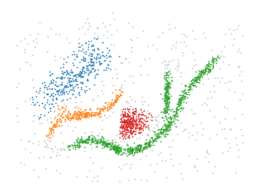

Alternatively, HDBSCAN\*’s leaf clusters provide more detail. They
segment the points of different branches into distinct clusters.
However, the partitioning and cluster hierarchy does not (necessarily)
tell us how those clusters combine into a larger shape.

.. code:: ipython3

    leaf_clusterer = HDBSCAN(min_cluster_size=15, cluster_selection_method='leaf').fit(data)
    plot(leaf_clusterer.labels_)

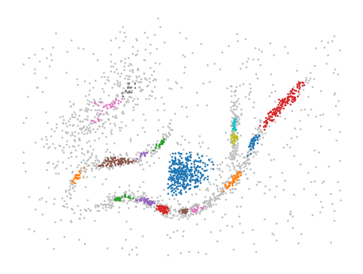

This is where the branch detection post-processing step comes into play.
The functionality is described in detail by `Bot et
al <https://peerj.com/articles/cs-2792/>`__ (please cite this paper
when using this functionality). It operates on the detected clusters and
extracts a branch-hierarchy analogous to HDBSCAN\*’s condensed cluster
hierarchy. The process is very similar to HDBSCAN\* clustering, except
that it operates on an in-cluster eccentricity rather than a density
measure. Where peaks in a density profile correspond to clusters, the
peaks in an eccentricity profile correspond to branches:

.. code:: ipython3

    import matplotlib.tri as mtri
    
    eccentricities = np.zeros(data.shape[0])
    for label in range(len(clusterer.cluster_persistence_)):
        mask = clusterer.labels_ == label
        centroid = np.average(
            data[mask],
            weights=clusterer.probabilities_[mask],
            axis=0,
        )
        eccentricities[mask] = np.linalg.norm(data[mask] - centroid, axis=1)
    
    fig = plt.figure()
    tri = mtri.Triangulation(data[:, 0], data[:, 1])
    ax = fig.add_subplot(1, 1, 1, projection="3d", computed_zorder=False)
    ax.view_init(elev=45, azim=-100)
    ax.scatter(
        data.T[0],
        data.T[1],
        np.repeat(eccentricities.min(), data.shape[0]),
        s=2,
        edgecolor="none",
        linewidth=0,
    )
    ax.tricontour(tri, eccentricities, levels=np.linspace(0, eccentricities.max(), 15))
    ax.set_xticklabels([])
    ax.set_yticklabels([])
    ax.set_zticklabels([])
    zlim = ax.get_zlim()
    ax.set_box_aspect(aspect=(3, 3, 1))

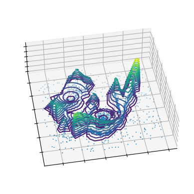

Using the branch detection functionality is fairly straightforward.
First, run hdbscan with parameter ``branch_detection_data=True``. This
tells hdbscan to cache the internal data structures needed for the
branch detection process. Then, configure the ``BranchDetector`` class
and fit is with the HDBSCAN object.

The resulting partitioning reflects subgroups for clusters and their
branches:

.. code:: ipython3

    clusterer = HDBSCAN(min_cluster_size=15, branch_detection_data=True).fit(data)
    branch_detector = BranchDetector(min_cluster_size=15).fit(clusterer)
    plot(branch_detector.labels_)

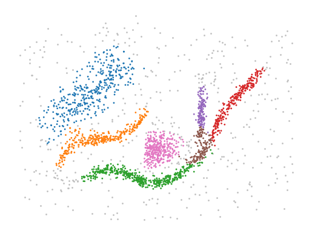

Parameter selection
-------------------

The ``BranchDetector``\ ’s main parameters are very similar to
HDBSCAN\*. Most guidelines for tuning HDBSCAN\* also apply to the branch
detector:

-  ``min_cluster_size`` configures how many points branches need to
   contain. Values around 10 to 25 points tend to work well. Lower
   values are useful when looking for smaller structures. Higher values
   can be used to suppress noise if present.
-  ``max_cluster_size``. Branches with more than the specified number of
   points are skipped, selecting their descendants in the hierarchy
   instead.
-  ``cluster_selection_method``. The leaf and Excess of Mass (EOM)
   strategies are used to select branches from the condensed
   hierarchies. By default, branches are only reflected in the final
   labelling for clusters that have 3 or more branches (at least one
   bifurcation).
-  ``cluster_selection_epsilon`` can be used to suppress branches that
   merge at low eccentricity values (y-value in the condensed hierarchy
   plot).
-  ``cluster_selection_persistence`` can be used to suppress branches
   with a short eccentricity range (y-range in the condensed hierarchy
   plot).
-  ``allow_single_cluster``. When enabled, clusters with bifurcations
   will be given a single label if the root segment contains most
   eccentricity mass (i.e., branches already merge far from the center
   and most points are central).

Two parameters are unique to the ``BranchDetector`` class:

-  ``branch_detection_method`` determines which points are connected
   within a cluster. Both density-based clustering and the branch
   detection process need to determine which points are part of the same
   density/eccentricity peak. HDBSCAN\* defines density in terms of the
   distance between points, providing natural way to define which points
   are connected at some density value. Eccentricity does not have such
   a connection. So, we use information from the clusters to determine
   which points should be connected instead.

   -  The ``"core"`` method selects all edges that could be part of the
      cluster’s minimum spanning tree under HDBSCAN\*’s mutual
      reachability distance. This graph contains the detected MST and
      all ``min_samples``-nearest neighbors.
   -  The ``"full"`` method connects all points with a mutual
      reachability lower than the maximum distance in the cluster’s MST.
      It represents all connectivity at the moment the last point joins
      the cluster. These methods differ in their sensitivity, noise
      robustness, and computational cost. The ``"core"`` method usually
      needs slightly higher ``min_branch_size`` values to suppress noisy
      branches than the ``"full"`` method. It is a good choice when
      branches span large density ranges.

-  ``label_sides_as_branches`` determines whether the sides of an
   elongated cluster without bifurcations (l-shape) are represented as
   distinct subgroups. By default a cluster needs to have one
   bifurcation (Y-shape) before the detected branches are represented in
   the final labelling.

Useful attributes
-----------------

Like the HDBSCAN class, the BranchDetector class contains several useful
attributes for exploring datasets.

Branch hierarchy
~~~~~~~~~~~~~~~~

Branch hierarchies reflect the tree-shape of clusters. Like the cluster
hierarchy, branch hierarchies can be used to interpret which branches
exist. In addition, they reflect how far apart branches merge into the
cluster.

.. code:: ipython3

    idx = np.argmax([len(x) for x in branch_detector.branch_persistences_])
    branch_detector.condensed_trees_[idx].plot(
        select_clusters=True, selection_palette=["C4", "C5", "C6"]
    )
    plt.ylabel("Eccentricity")
    plt.title(f"Branches in cluster {idx}")
    plt.show()

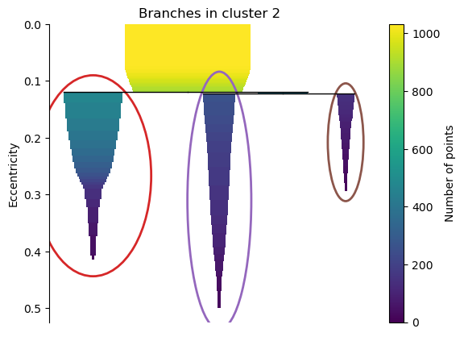

The length of the branches also says something about the compactness /
elongatedness of clusters. For example, the branch hierarchy for the
orange ~-shaped cluster is quite different from the same hierarchy for
the central o-shaped cluster.

.. code:: ipython3

    plt.figure(figsize=(6, 3))
    plt.subplot(1, 2, 1)
    idx = np.argmin([min(*x) for x in branch_detector.branch_persistences_])
    branch_detector.condensed_trees_[idx].plot(colorbar=False)
    plt.ylim([0.3, 0])
    plt.ylabel("Eccentricity")
    plt.title(f"Cluster {idx} (spherical)")
    
    plt.subplot(1, 2, 2)
    idx = np.argmax([max(*x) for x in branch_detector.branch_persistences_])
    branch_detector.condensed_trees_[idx].plot(colorbar=False)
    plt.ylim([0.3, 0])
    plt.ylabel("Eccentricity")
    plt.title(f"Cluster {idx} (elongated)")
    plt.show()

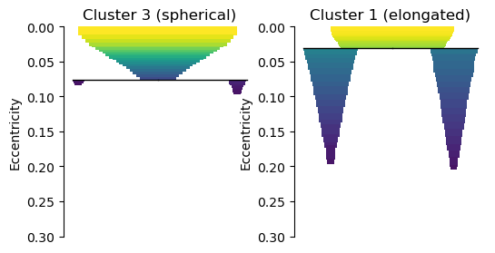

Cluster approximation graphs
~~~~~~~~~~~~~~~~~~~~~~~~~~~~

Branches are detected using a graph that approximates the connectivity
within a cluster. These graphs are available in the
``cluster_approximation_graph_`` property and can be used to visualize
data and the branch-detection process. The plotting function is based on
the networkx API and uses networkx functionality to compute a layout if
positions are not provided. Using UMAP to compute positions can be
faster and more expressive. Several helper functions for exporting to
numpy, pandas, and networkx are available.

For example, a figure with points coloured by the final labelling:

.. code:: ipython3

    g = branch_detector.approximation_graph_
    g.plot(positions=data, node_size=5, edge_width=0.2, edge_alpha=0.2)
    plt.show()

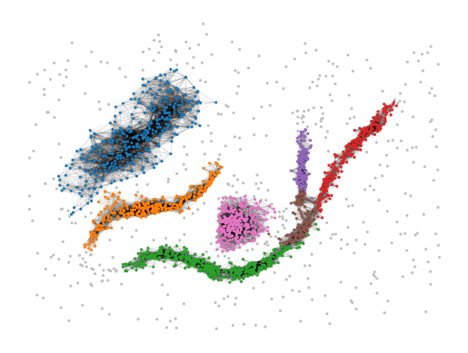

Or, a figure with the edges coloured by centrality:

.. code:: ipython3

    g.plot(
        positions=data,
        node_alpha=0,
        edge_color="centrality",
        edge_cmap="turbo",
        edge_width=0.2,
        edge_alpha=0.2,
        edge_vmax=100,
    )
    plt.show()

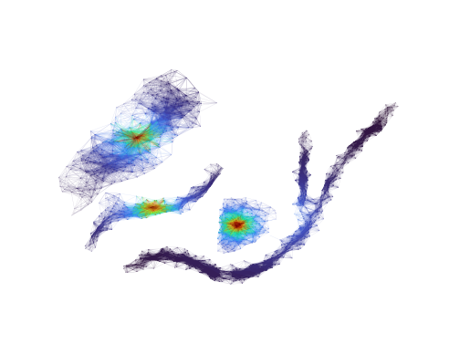

Approximate predict
-------------------

A branch-aware ``approximate_predict_branch`` function is available to
predicts branch labels for new points. This function uses a fitted
BranchDetector object to first predict cluster labels and then the
branch labels.

.. code:: ipython3

    from hdbscan import approximate_predict_branch
    
    new_points = np.asarray([[0.4, 0.25], [0.23, 0.2], [-0.14, -0.2]])
    clusterer.generate_prediction_data()
    labels, probs, cluster_labels, cluster_probs, branch_labels, branch_probs = (
        approximate_predict_branch(branch_detector, new_points)
    )
    
    plt.scatter(
        new_points.T[0],
        new_points.T[1],
        140,
        labels % 10,
        marker="p",
        zorder=5,
        cmap="tab10",
        vmin=0,
        vmax=9,
        edgecolor="k",
    )
    plot(branch_detector.labels_)
    plt.show()

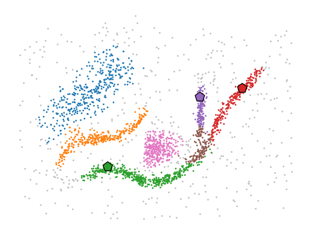

Detect branches in other clusters
---------------------------------

It is possible to evaluate the ``BranchDetector`` class with non-HDBSCAN
clusters through the optional arguments of its ``.fit()`` method. In the
example below, two clusters are merged manually, resulting in a
different branching structure. This functionality can be used to look
for branches in, f.i., DBSCAN labels.

.. code:: ipython3

    # Valid option
    custom_labels = clusterer.labels_.copy()
    custom_labels[clusterer.labels_ == 3] = 2
    branch_detector.fit(clusterer, custom_labels)
    plot(branch_detector.labels_)

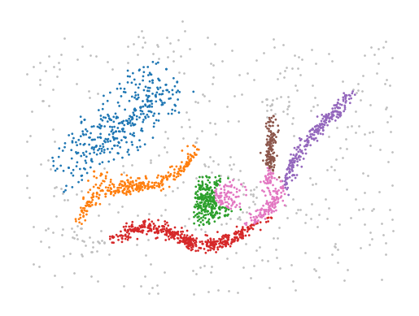

Custom clusters only work if they are within-cluster-path-connected in
HDBSCAN’s minimum spanning tree (MST). In other words, the MST edges
between all points in the cluster must form a single connected
component. Custom clusters that break this condition return the MST
connected component labels instead of branches, without looking for
branches!!

.. code:: ipython3

    # Invalid labels cannot find branches!
    custom_labels = clusterer.labels_.copy()
    custom_labels[clusterer.labels_ == 3] = 0
    branch_detector.fit(clusterer, custom_labels)
    plot(branch_detector.labels_)

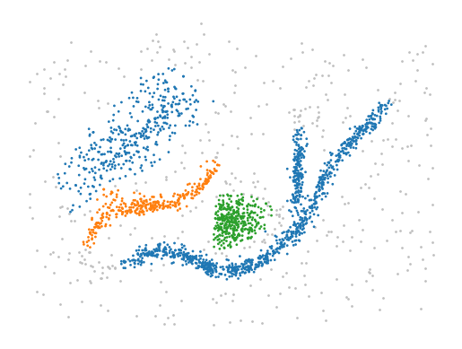

Citing
------

If you used the branch-detection functionality in this library please cite our `PeerJ paper <https://peerj.com/articles/cs-2792/>`_: 

    Bot DM, Peeters J, Liesenborgs J, Aerts J. 2025. FLASC: a flare-sensitive
    clustering algorithm. PeerJ Computer Science 11:e2792
    https://doi.org/10.7717/peerj-cs.2792 

.. code:: bibtex

    @article{bot2025flasc,
        title   = {{FLASC: a flare-sensitive clustering algorithm}},
        author  = {Bot, Dani{\"{e}}l M. and Peeters, Jannes and Liesenborgs, Jori and Aerts, Jan},
        year    = {2025},
        month   = {apr},
        journal = {PeerJ Comput. Sci.},
        volume  = {11},
        pages   = {e2792},
        issn    = {2376-5992},
        doi     = {10.7717/peerj-cs.2792},
        url     = {https://peerj.com/articles/cs-2792},
    }
