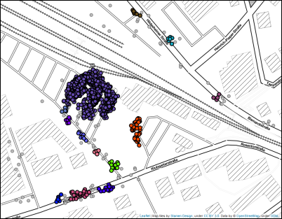
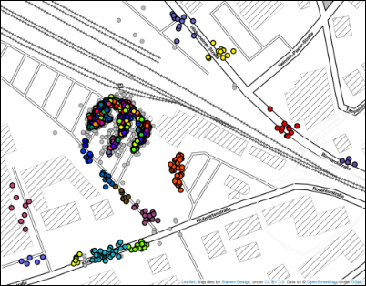
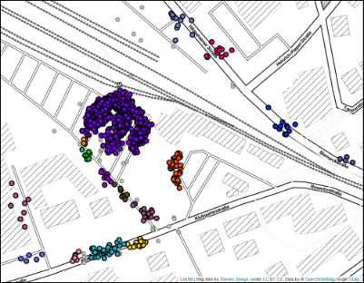
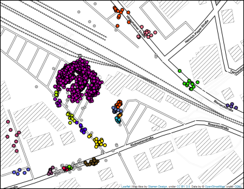

Combining HDBSCAN\* with DBSCAN 
=============================

While DBSCAN needs a minimum cluster size *and* a distance threshold epsilon as user-defined input parameters, 
HDBSCAN\* is basically a DBSCAN implementation for varying epsilon values and therefore only needs the minimum cluster size as single input parameter.
The ``'eom'`` (Excess of Mass) cluster selection method then returns clusters with the best stability over epsilon.

Unlike DBSCAN, this allows to it find clusters of variable densities without having to choose a suitable distance threshold first.
However, there are cases where we could still benefit from the use of an epsilon threshold.

For illustration, see this map with GPS locations, representing recorded pick-up and drop-off locations for customers of a ride pooling provider.
The largest (visual) data cluster can be found around the train station. Smaller clusters are placed along the streets, depending on the requested location
in the form of a postal address or point of interest. Since we are considering a door-to-door system where customers are not bound to collective pick-up or
drop-off locations, we are interested in both large clusters and small clusters with a minimum size of 4.  

.. image:: images/epsilon_parameter_dataset.png
	:align: center
	
Clustering the given data set with `DBSCAN <https://scikit-learn.org/stable/modules/generated/sklearn.cluster.DBSCAN.html>`__ and an epsilon threshold of 5 meters gives us good results, 
but neglects clusters with points that are more than 5 meters apart from each other. 
However, increasing epsilon would result in cluster chains along the streets, especially when working with a larger data set. 

Unfortunately, HDBSCAN\* does not produce any better results in this case: while it discovers the clusters that DBSCAN missed, it also returns a very high number of micro-clusters around the train station, 
even though we would prefer one or only few clusters representing this location. We could achieve this by increasing ``min_cluster_size`` or 
the smoothing parameter ``min_samples``, but with the trade-off of losing small clusters in less dense areas or merging them into other clusters 
separated by a relatively large distance.

	
This is where the parameter ``cluster_selection_epsilon`` comes into play. The cluster extraction method using this parameter, as described in detail
by `Malzer and Baum <https://arxiv.org/abs/1911.02282>`__, acts like a hybrid between DBSCAN 
(or, to be precise, DBSCAN\*, i.e. DBSCAN without the border points) by extracting DBSCAN results for data partitions
affected by the given parameter value, and HDBSCAN\* results for all others. 

In our example, we choose to merge nested clusters below 5 meters (0.005 kilometers) and therefore set  the parameter ``cluster_selection_epsilon`` accordingly: 

.. code:: python

	X = np.radians(coordinates) #convert the list of lat/lon coordinates to radians
	earth_radius_km = 6371
	epsilon = 0.005 / earth_radius_km #calculate 5 meter epsilon threshold
	
	clusterer = hdbscan.HDBSCAN(min_cluster_size=4, metric='haversine', 
	cluster_selection_epsilon=epsilon, cluster_selection_method = 'eom')
	clusterer.fit(X)
	
And indeed, the result looks like a mix between DBSCAN and HDBSCAN(eom). We no longer lose clusters of variable densities beyond the given epsilon, but at the
same time avoid the abundance of micro-clusters in the original HDBSCAN\* clustering, which was an undesired side-effect of having to choose a low ``min_cluster_size`` value.

	
Note that for the given parameter setting, running HDBSCAN\* based on ``cluster_selection_method = 'eom'`` or ``cluster_selection_method = 'leaf'`` does not make
any difference: the ``cluster_selection_epsilon`` threshold neutralizes the effect of HDBSCAN(eom)'s stability calculations.
When using a lower threshold, some minor differences can be noticed. For example, an epsilon value of 3 meters with ``'eom'`` produces the same results as
a the 5 meter value on the given data set, but 3 meters in combination with ``'leaf'`` achieves a slightly different result:
	

A ``cluster_selection_epsilon`` value of 0 (the default value) always returns the original HDBSCAN\* results, either according to ``'eom'`` or ``'leaf'``.
	
