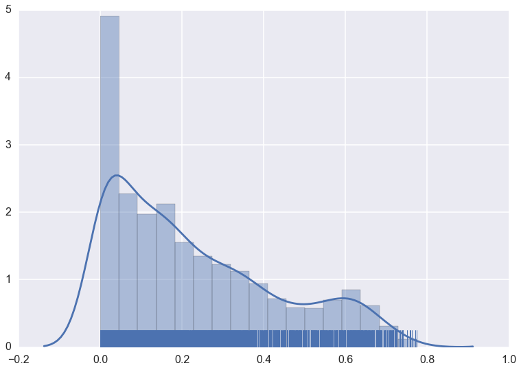
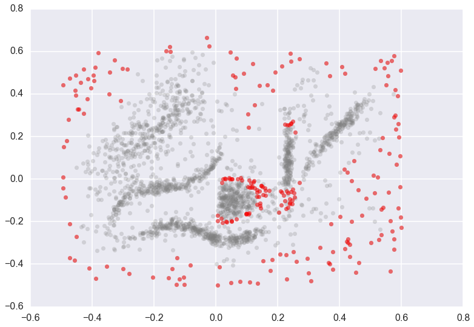

Outlier Detection
=================

The hdbscan library supports the GLOSH outlier detection algorithm, and
does so within the HDBSCAN clustering class. The GLOSH outlier detection
algorithm is related to older outlier detection methods such as
`LOF <https://en.wikipedia.org/wiki/Local_outlier_factor>`__ and
`LOCI <http://www.informedia.cs.cmu.edu/documents/loci_icde03.pdf>`__.
It is a fast and flexible outlier detection system, and supports a
notion of local outliers. This means that it can detect outliers that
may be noticeably different from points in its local region (for example
points not on a local submanifold) but that are not necessarily outliers
globally. So how do we find outliers? We proceed identically to the
basic use of HDBSCAN\*. We start with some data, and fit it with an
HDBSCAN object.

.. code:: python

    plt.scatter(*data.T, s=50, linewidth=0, c='b', alpha=0.25)

.. image:: images/outlier_detection_3_1.png

.. code:: python

    clusterer = hdbscan.HDBSCAN(min_cluster_size=15).fit(data)

The ``clusterer`` object now has an attribute (computed when first accessed)
called ``outlier_scores_``. This provides a numpy array with a value for
each sample in the original dataset that was fit with the ``clusterer``. The
higher the score, the more likely the point is to be an outlier. In
practice it is often best to look at the distributions of outlier
scores.

.. code:: python

    clusterer.outlier_scores_

.. parsed-literal::

    array([ 0.14791852,  0.14116731,  0.09171929, ...,  0.62050534,
            0.56749298,  0.20681685])

.. code:: python

    sns.distplot(clusterer.outlier_scores_[np.isfinite(clusterer.outlier_scores_)], rug=True)

We can pull off upper quantiles to detect outliers, which we can then
plot.

.. code:: python

    threshold = pd.Series(clusterer.outlier_scores_).quantile(0.9)
    outliers = np.where(clusterer.outlier_scores_ > threshold)[0]
    plt.scatter(*data.T, s=50, linewidth=0, c='gray', alpha=0.25)
    plt.scatter(*data[outliers].T, s=50, linewidth=0, c='red', alpha=0.5)

Note that not only are the outlying border points highlighted as
outliers, but points at the edge of the central ball like cluster, and
just below the vertical band cluster, are also designated as outliers.
This is because those two clusters are extremely dense, and the points
at the edge of this cluster are close enough to the cluster that they
should be part of it, but far enough from the being core parts of the
cluster that they are extremely unlikely and hence anomalous.

