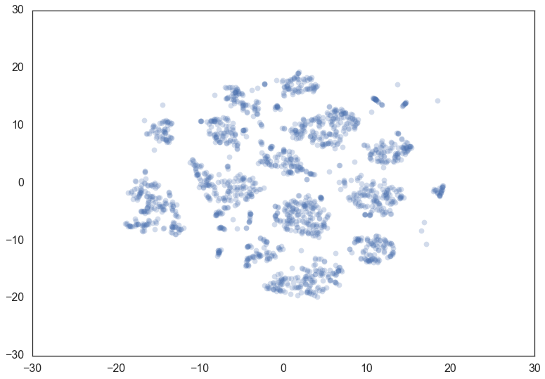
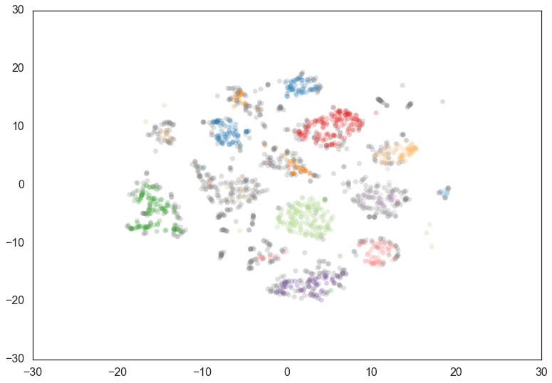
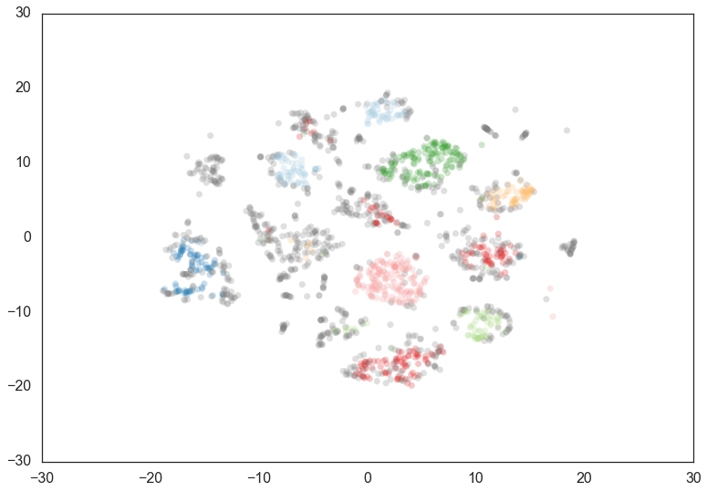
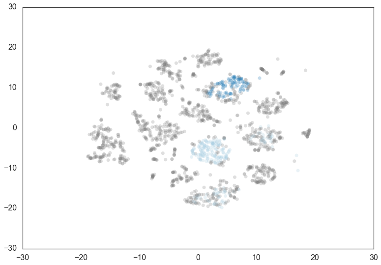
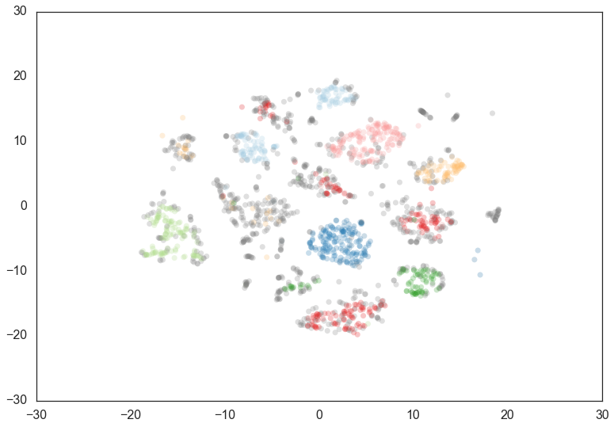
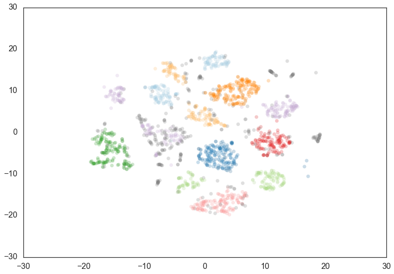
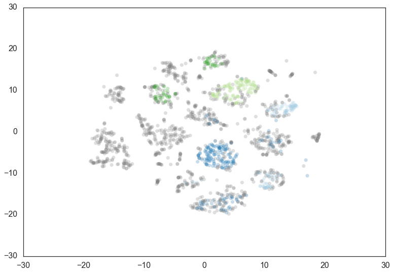

Parameter Selection for HDBSCAN\*
=================================

While the HDBSCAN class has a large number of parameters that can be set
on initialization, in practice there are a very small number of
parameters that have significant practical effect on clustering. We will
first consider those major parameters, and consider how one may go about
choosing them effectively. With that out of the way we'll look at the
remaining parameters and see what their effects are -- many just effect
performance for various different use cases.

Selecting ``min_cluster_size``
------------------------------

The primary parameter to effect the resulting clustering is
``min_cluster_size``. Ideally this is a relatively intuitive parameter
to select -- set it to the smallest size grouping that you sih to
consider a cluster. It can have slightly non-obvious effects however.
Let's consider the digits dataset from sklearn. We can project the data
into two dimensions to visualize it via t-SNE.

    digits = datasets.load_digits()
    data = digits.data
    projection = TSNE().fit_transform(data)
    plt.scatter(*projection.T, **plot_kwds)

If we cluster this data in the full 64 dimensional space with hdbscan we
can see some effects from varying the ``min_cluster_size``.

We start with a ``min_cluster_size`` of 15.

.. code:: python

    clusterer = hdbscan.HDBSCAN(min_cluster_size=15).fit(data)
    color_palette = sns.color_palette('Paired', 12)
    cluster_colors = [color_palette[x] if x >= 0 
                      else (0.5, 0.5, 0.5) 
                      for x in clusterer.labels_]
    cluster_member_colors = [sns.desaturate(x, p) for x, p in 
                             zip(cluster_colors, clusterer.probabilities_)]
    plt.scatter(*projection.T, s=50, linewidth=0, c=cluster_member_colors, alpha=0.25)

Increasing the ``min_cluster_size`` to 30 reduces the number of
clusters, merging some together. This is a result of HDBSCAN\*
reoptimizing which flat clustering provides greater stability under a
slightly different notion of what constitutes cluster.

.. code:: python

    clusterer = hdbscan.HDBSCAN(min_cluster_size=30).fit(data)
    color_palette = sns.color_palette('Paired', 12)
    cluster_colors = [color_palette[x] if x >= 0 
                      else (0.5, 0.5, 0.5) 
                      for x in clusterer.labels_]
    cluster_member_colors = [sns.desaturate(x, p) for x, p in 
                             zip(cluster_colors, clusterer.probabilities_)]
    plt.scatter(*projection.T, s=50, linewidth=0, c=cluster_member_colors, alpha=0.25)

Doubling the ``min_cluster_size`` again to 60 gives us just two clusters
-- the really core clusters. This is somewhat as expected, but surely
some of the other clusters that we had previously had more than 60
members? Why are they being considered noise? The answer is that
HDBSCAN\* has a second parameter ``min_samples``. The implementation
defaults this value (if it is unspecified) to whatever
``min_cluster_size`` is set to. We can recover some of our original
clusters by explicitly providing ``min_samples`` at the original value
of 15.

.. code:: python

    clusterer = hdbscan.HDBSCAN(min_cluster_size=60).fit(data)
    color_palette = sns.color_palette('Paired', 12)
    cluster_colors = [color_palette[x] if x >= 0 
                      else (0.5, 0.5, 0.5) 
                      for x in clusterer.labels_]
    cluster_member_colors = [sns.desaturate(x, p) for x, p in 
                             zip(cluster_colors, clusterer.probabilities_)]
    plt.scatter(*projection.T, s=50, linewidth=0, c=cluster_member_colors, alpha=0.25)

.. code:: python

    clusterer = hdbscan.HDBSCAN(min_cluster_size=60, min_samples=15).fit(data)
    color_palette = sns.color_palette('Paired', 12)
    cluster_colors = [color_palette[x] if x >= 0 
                      else (0.5, 0.5, 0.5) 
                      for x in clusterer.labels_]
    cluster_member_colors = [sns.desaturate(x, p) for x, p in 
                             zip(cluster_colors, clusterer.probabilities_)]
    plt.scatter(*projection.T, s=50, linewidth=0, c=cluster_member_colors, alpha=0.25)

As you can see this results in us recovering something much closer to
our original clustering, only now with some of the smaller clusters
pruned out. Thus ``min_cluster_size`` does behave more closely to our
intuitions, but only if we fix ``min_samples``. If you wish to explore
different ``min_cluster_size`` settings with a fixed ``min_samples``
value, especially for larger dataset sizes, you can cache the hard
computation, and recompute onlythe relatively cheap flat cluster
extraction using the ``memory`` parameter, which makes use of ``joblib``
[link].

Selecting ``min_samples``
-----------------------

Since we have seen that ``min_samples`` clearly has a dramatic effect on
clustering, the question becomes: how do we select this parameter? The
simplest intuition for what ``min_samples`` does is provide a measure of
how conservative you want you clustering to be. The larger the value of
``min_samples`` you provide, the more conservative the clustering --
more points will be declared as noise, and clusters will be restricted
to progressively more dense areas. We can see this in practice by
leaving the ``min_cluster_size`` at 60, but reducing ``min_samples`` to
1.

.. code:: python

    clusterer = hdbscan.HDBSCAN(min_cluster_size=60, min_samples=1).fit(data)
    color_palette = sns.color_palette('Paired', 12)
    cluster_colors = [color_palette[x] if x >= 0 
                      else (0.5, 0.5, 0.5) 
                      for x in clusterer.labels_]
    cluster_member_colors = [sns.desaturate(x, p) for x, p in 
                             zip(cluster_colors, clusterer.probabilities_)]
    plt.scatter(*projection.T, s=50, linewidth=0, c=cluster_member_colors, alpha=0.25)

.. parsed-literal::

    <matplotlib.collections.PathCollection at 0x120978438>

Now most points are clustered, and there are much fewer noise points.
Steadily increasing ``min_samples`` will, as we saw in the examples
above, make the clustering progressivly more conservative, culiminating
in the example above where ``min_samples`` was set to 60 and we had only
two clusters with most points declared as noise.

Selecting ``alpha``
-----------------

A further parameter that effects the resulting clustering is ``alpha``.
In practice it is best not to mess with this paramter -- ultimately it
is part of the ``RobustSingleLinkage`` code, but flows naturally into
HDBSCAN\*. If, for some reason, ``min_samples`` is not providing you
what you need, stop, rethink things, and try again with ``min_samples``.
If you still need to play with another parameter (and you shouldn't),
then you can try setting ``alpha``. The ``alpha`` parameter provides a
slightly different approach to determining how conservative the
clustering is. By default ``alpha`` is set to 1.0. Increasing ``alpha``
will make the clustering more conservative, but on a much tighter scale,
as we can see by setting ``alpha`` to 1.3.

.. code:: python

    clusterer = hdbscan.HDBSCAN(min_cluster_size=60, min_samples=15, alpha=1.3).fit(data)
    color_palette = sns.color_palette('Paired', 12)
    cluster_colors = [color_palette[x] if x >= 0 
                      else (0.5, 0.5, 0.5) 
                      for x in clusterer.labels_]
    cluster_member_colors = [sns.desaturate(x, p) for x, p in 
                             zip(cluster_colors, clusterer.probabilities_)]
    plt.scatter(*projection.T, s=50, linewidth=0, c=cluster_member_colors, alpha=0.25)

