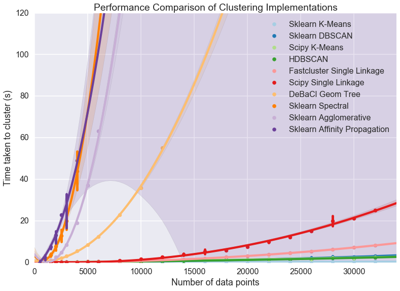
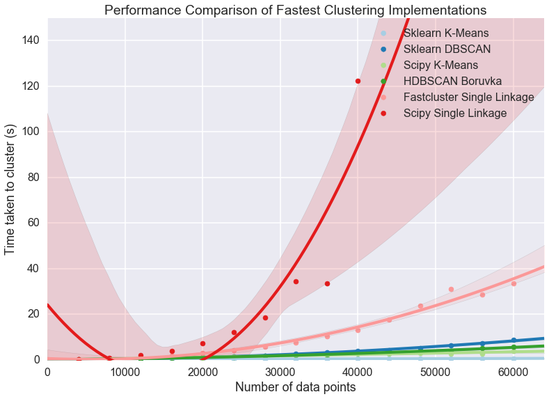
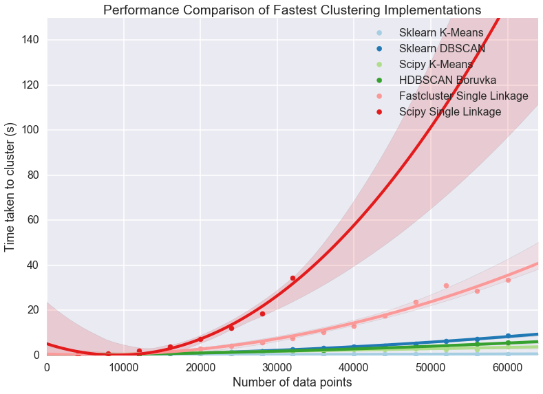
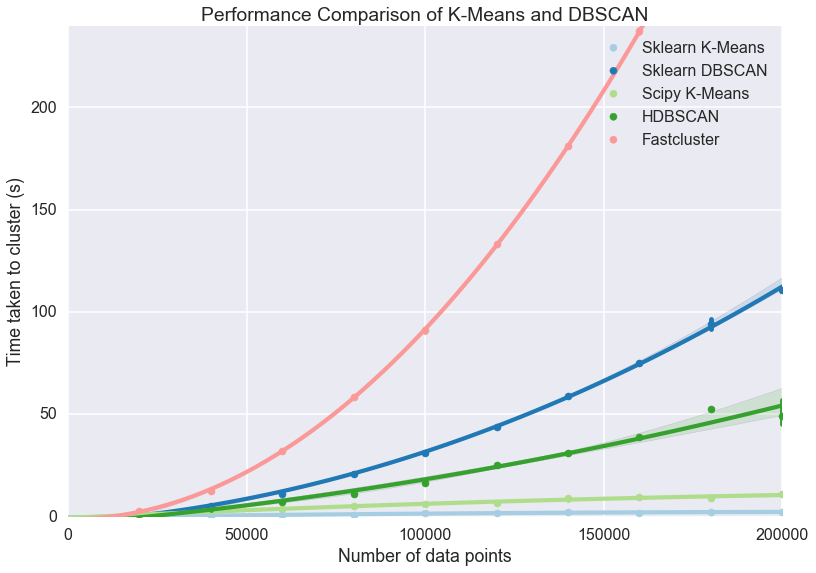

Benchmarking Performance and Scaling of Python Clustering Algorithms
====================================================================

There are a host of different clustering algorithms and implementations
thereof for Python. The performance and scaling can depend as much on
the implementation as the underlying algorithm. Obviously a well written
implementation in C or C++ will beat a naive implementation on pure
Python, but there is more to it than just that. The internals and data
structures used can have a large impact on performance, and can even
significanty change asymptotic performance. All of this means that,
given some amount of data that you want to cluster your options as to
algorithm and implementation maybe significantly constrained. I'm both
lazy, and prefer empirical results for this sort of thing, so rather
than analyzing the implementations and deriving asymptotic performance
numbers for various implementations I'm just going to run everything and
see what happens.

To begin with we need to get together all the clustering
implementations, along with some plotting libraries so we can see what
is going on once we've got data. Obviously this is not an exhaustive
collection of clustering implementations, so if I've left off your
favourite I apologise, but one has to draw a line somewhere.

The implementations being tested are:

-  `Sklearn <http://scikit-learn.org/stable/modules/clustering.html>`__
   (which implements several algorithms):
-  K-Means clustering
-  DBSCAN clustering
-  Agglomerative clustering
-  Spectral clustering
-  Affinity Propagation
-  `Scipy <http://docs.scipy.org/doc/scipy/reference/cluster.html>`__
   (which provides basic algorithms):
-  K-Means clustering
-  Agglomerative clustering
-  `Fastcluster <http://danifold.net/fastcluster.html>`__ (which
   provides very fast agglomerative clustering in C++)
-  `DeBaCl <https://github.com/CoAxLab/DeBaCl>`__ (Density Based
   Clustering; similar to a mix of DBSCAN and Agglomerative)
-  `HDBSCAN <https://github.com/scikit-learn-contrib/hdbscan>`__ (A robust
   hierarchical version of DBSCAN)

Obviously a major factor in performance will be the algorithm itself.
Some algorithms are simply slower -- often, but not always, because they
are doing more work to provide a better clustering.

.. code:: python

    import hdbscan
    import debacl
    import fastcluster
    import sklearn.cluster
    import scipy.cluster
    import sklearn.datasets
    import numpy as np
    import pandas as pd
    import time
    import matplotlib.pyplot as plt
    import seaborn as sns
    %matplotlib inline
    sns.set_context('poster')
    sns.set_palette('Paired', 10)
    sns.set_color_codes()

Now we need some benchmarking code at various dataset sizes. Because
some clustering algorithms have performance that can vary quite a lot
depending on the exact nature of the dataset we'll also need to run
several times on randomly generated datasets of each size so as to get a
better idea of the average case performance.

We also need to generalise over algorithms which don't necessarily all
have the same API. We can resolve that by taking a clustering function,
argument tuple and keywords dictionary to let us do semi-arbitrary calls
(fortunately all the algorithms do at least take the dataset to cluster
as the first parameter).

Finally some algorithms scale poorly, and I don't want to spend forever
doing clustering of random datasets so we'll cap the maximum time an
algorithm can use; once it has taken longer than max time we'll just
abort there and leave the remaining entries in our datasize by samples
matrix unfilled.

In the end this all amounts to a fairly straightforward set of nested
loops (over datasizes and number of samples) with calls to sklearn to
generate mock data and the clustering function inside a timer. Add in
some early abort and we're done.

.. code:: python

    def benchmark_algorithm(dataset_sizes, cluster_function, function_args, function_kwds,
                            dataset_dimension=10, dataset_n_clusters=10, max_time=45, sample_size=2):
        
        # Initialize the result with NaNs so that any unfilled entries 
        # will be considered NULL when we convert to a pandas dataframe at the end
        result = np.nan * np.ones((len(dataset_sizes), sample_size))
        for index, size in enumerate(dataset_sizes):
            for s in range(sample_size):
                # Use sklearns make_blobs to generate a random dataset with specified size
                # dimension and number of clusters
                data, labels = sklearn.datasets.make_blobs(n_samples=size, 
                                                           n_features=dataset_dimension, 
                                                           centers=dataset_n_clusters)
                
                # Start the clustering with a timer
                start_time = time.time()
                cluster_function(data, *function_args, **function_kwds)
                time_taken = time.time() - start_time
                
                # If we are taking more than max_time then abort -- we don't
                # want to spend excessive time on slow algorithms
                if time_taken > max_time:
                    result[index, s] = time_taken
                    return pd.DataFrame(np.vstack([dataset_sizes.repeat(sample_size), 
                                                   result.flatten()]).T, columns=['x','y'])
                else:
                    result[index, s] = time_taken
            
        # Return the result as a dataframe for easier handling with seaborn afterwards
        return pd.DataFrame(np.vstack([dataset_sizes.repeat(sample_size), 
                                       result.flatten()]).T, columns=['x','y'])

Comparison of all ten implementations
-------------------------------------

Now we need a range of dataset sizes to test out our algorithm. Since
the scaling performance is wildly different over the ten implementations
we're going to look at it will be beneficial to have a number of very
small dataset sizes, and increasing spacing as we get larger, spanning
out to 32000 datapoints to cluster (to begin with). Numpy provides
convenient ways to get this done via ``arange`` and vector
multiplication. We'll start with step sizes of 500, then shift to steps
of 1000 past 3000 datapoints, and finally steps of 2000 past 6000
datapoints.

.. code:: python

    dataset_sizes = np.hstack([np.arange(1, 6) * 500, np.arange(3,7) * 1000, np.arange(4,17) * 2000])

Now it is just a matter of running all the clustering algorithms via our
benchmark function to collect up all the requsite data. This could be
prettier, rolled up into functions appropriately, but sometimes brute
force is good enough. More importantly (for me) since this can take a
significant amount of compute time, I wanted to be able to comment out
algorithms that were slow or I was uninterested in easily. Which brings
me to a warning for you the reader and potential user of the notebook:
this next step is very expensive. We are running ten different
clustering algorithms multiple times each on twenty two different
dataset sizes -- and some of the clustering algorithms are slow (we are
capping out at forty five seconds per run). That means that the next
cell can take an hour or more to run. That doesn't mean "Don't try this
at home" (I actually encourage you to try this out yourself and play
with dataset parameters and clustering parameters) but it does mean you
should be patient if you're going to!

.. code:: python

    k_means = sklearn.cluster.KMeans(10)
    k_means_data = benchmark_algorithm(dataset_sizes, k_means.fit, (), {})
    
    dbscan = sklearn.cluster.DBSCAN(eps=1.25)
    dbscan_data = benchmark_algorithm(dataset_sizes, dbscan.fit, (), {})
    
    scipy_k_means_data = benchmark_algorithm(dataset_sizes, 
                                             scipy.cluster.vq.kmeans, (10,), {})
    
    scipy_single_data = benchmark_algorithm(dataset_sizes, 
                                            scipy.cluster.hierarchy.single, (), {})
    
    fastclust_data = benchmark_algorithm(dataset_sizes, 
                                         fastcluster.linkage_vector, (), {})
    
    hdbscan_ = hdbscan.HDBSCAN()
    hdbscan_data = benchmark_algorithm(dataset_sizes, hdbscan_.fit, (), {})
    
    debacl_data = benchmark_algorithm(dataset_sizes, 
                                      debacl.geom_tree.geomTree, (5, 5), {'verbose':False})
    
    agglomerative = sklearn.cluster.AgglomerativeClustering(10)
    agg_data = benchmark_algorithm(dataset_sizes, 
                                   agglomerative.fit, (), {}, sample_size=4)
    
    spectral = sklearn.cluster.SpectralClustering(10)
    spectral_data = benchmark_algorithm(dataset_sizes, 
                                        spectral.fit, (), {}, sample_size=6)
    
    affinity_prop = sklearn.cluster.AffinityPropagation()
    ap_data = benchmark_algorithm(dataset_sizes, 
                                  affinity_prop.fit, (), {}, sample_size=3)

Now we need to plot the results so we can see what is going on. The
catch is that we have several datapoints for each dataset size and
ultimately we would like to try and fit a curve through all of it to get
the general scaling trend. Fortunately
`seaborn <http://stanford.edu/~mwaskom/software/seaborn/>`__ comes to
the rescue here by providing ``regplot`` which plots a regression
through a dataset, supports higher order regression (we should probably
use order two as most algorithms are effectively quadratic) and handles
multiple datapoints for each x-value cleanly (using the ``x_estimator``
keyword to put a point at the mean and draw an error bar to cover the
range of data).

.. code:: python

    sns.regplot(x='x', y='y', data=k_means_data, order=2, 
                label='Sklearn K-Means', x_estimator=np.mean)
    sns.regplot(x='x', y='y', data=dbscan_data, order=2, 
                label='Sklearn DBSCAN', x_estimator=np.mean)
    sns.regplot(x='x', y='y', data=scipy_k_means_data, order=2, 
                label='Scipy K-Means', x_estimator=np.mean)
    sns.regplot(x='x', y='y', data=hdbscan_data, order=2, 
                label='HDBSCAN', x_estimator=np.mean)
    sns.regplot(x='x', y='y', data=fastclust_data, order=2, 
                label='Fastcluster Single Linkage', x_estimator=np.mean)
    sns.regplot(x='x', y='y', data=scipy_single_data, order=2, 
                label='Scipy Single Linkage', x_estimator=np.mean)
    sns.regplot(x='x', y='y', data=debacl_data, order=2, 
                label='DeBaCl Geom Tree', x_estimator=np.mean)
    sns.regplot(x='x', y='y', data=spectral_data, order=2, 
                label='Sklearn Spectral', x_estimator=np.mean)
    sns.regplot(x='x', y='y', data=agg_data, order=2, 
                label='Sklearn Agglomerative', x_estimator=np.mean)
    sns.regplot(x='x', y='y', data=ap_data, order=2, 
                label='Sklearn Affinity Propagation', x_estimator=np.mean)
    plt.gca().axis([0, 34000, 0, 120])
    plt.gca().set_xlabel('Number of data points')
    plt.gca().set_ylabel('Time taken to cluster (s)')
    plt.title('Performance Comparison of Clustering Implementations')
    plt.legend()

.. parsed-literal::

    <matplotlib.legend.Legend at 0x1125dee50>

A few features stand out. First of all there appear to be essentially
two classes of implementation, with DeBaCl being an odd case that falls
in the middle. The fast implementations tend to be implementations of
single linkage agglomerative clustering, K-means, and DBSCAN. The slow
cases are largely from sklearn and include agglomerative clustering (in
this case using Ward instead of single linkage).

For practical purposes this means that if you have much more than 10000
datapoints your clustering options are significantly constrained:
sklearn spectral, agglomerative and affinity propagation are going to
take far too long. DeBaCl may still be an option, but given that the
hdbscan library provides "robust single linkage clustering" equivalent
to what DeBaCl is doing (and with effectively the same runtime as
hdbscan as it is a subset of that algorithm) it is probably not the best
choice for large dataset sizes.

So let's drop out those slow algorithms so we can scale out a little
further and get a closer look at the various algorithms that managed
32000 points in under thirty seconds. There is almost undoubtedly more
to learn as we get ever larger dataset sizes.

Comparison of fast implementations
----------------------------------

Let's compare the six fastest implementations now. We can scale out a
little further as well; based on the curves above it looks like we
should be able to comfortably get to 60000 data points without taking
much more than a minute per run. We can also note that most of these
implementations weren't that noisy so we can get away with a single run
per dataset size.

.. code:: python

    large_dataset_sizes = np.arange(1,16) * 4000
    
    hdbscan_boruvka = hdbscan.HDBSCAN(algorithm='boruvka_kdtree')
    large_hdbscan_boruvka_data = benchmark_algorithm(large_dataset_sizes, 
                                             hdbscan_boruvka.fit, (), {}, 
                                                     max_time=90, sample_size=1)
    
    k_means = sklearn.cluster.KMeans(10)
    large_k_means_data = benchmark_algorithm(large_dataset_sizes, 
                                             k_means.fit, (), {}, 
                                             max_time=90, sample_size=1)
    
    dbscan = sklearn.cluster.DBSCAN(eps=1.25, min_samples=5)
    large_dbscan_data = benchmark_algorithm(large_dataset_sizes, 
                                            dbscan.fit, (), {}, 
                                            max_time=90, sample_size=1)
    
    large_fastclust_data = benchmark_algorithm(large_dataset_sizes, 
                                               fastcluster.linkage_vector, (), {}, 
                                               max_time=90, sample_size=1)
    
    large_scipy_k_means_data = benchmark_algorithm(large_dataset_sizes, 
                                                   scipy.cluster.vq.kmeans, (10,), {}, 
                                                   max_time=90, sample_size=1)
    
    large_scipy_single_data = benchmark_algorithm(large_dataset_sizes, 
                                                  scipy.cluster.hierarchy.single, (), {}, 
                                                  max_time=90, sample_size=1)

Again we can use seaborn to do curve fitting and plotting, exactly as
before.

.. code:: python

    sns.regplot(x='x', y='y', data=large_k_means_data, order=2, 
                label='Sklearn K-Means', x_estimator=np.mean)
    sns.regplot(x='x', y='y', data=large_dbscan_data, order=2, 
                label='Sklearn DBSCAN', x_estimator=np.mean)
    sns.regplot(x='x', y='y', data=large_scipy_k_means_data, order=2, 
                label='Scipy K-Means', x_estimator=np.mean)
    sns.regplot(x='x', y='y', data=large_hdbscan_boruvka_data, order=2, 
                label='HDBSCAN Boruvka', x_estimator=np.mean)
    sns.regplot(x='x', y='y', data=large_fastclust_data, order=2, 
                label='Fastcluster Single Linkage', x_estimator=np.mean)
    sns.regplot(x='x', y='y', data=large_scipy_single_data, order=2, 
                label='Scipy Single Linkage', x_estimator=np.mean)
    
    plt.gca().axis([0, 64000, 0, 150])
    plt.gca().set_xlabel('Number of data points')
    plt.gca().set_ylabel('Time taken to cluster (s)')
    plt.title('Performance Comparison of Fastest Clustering Implementations')
    plt.legend()

.. parsed-literal::

    <matplotlib.legend.Legend at 0x116038bd0>

Clearly something has gone woefully wrong with the curve fitting for the
scipy single linkage implementation, but what exactly? If we look at the
raw data we can see.

.. code:: python

    large_scipy_single_data.tail(10)

.. raw:: html

    

    <table border="1" class="dataframe">
      <thead>
        <tr style="text-align: right;">
          <th></th>
          <th>x</th>
          <th>y</th>
        </tr>
      </thead>
      <tbody>
        <tr>
          <th>5</th>
          <td>24000.0</td>
          <td>12.127519</td>
        </tr>
        <tr>
          <th>6</th>
          <td>28000.0</td>
          <td>18.367958</td>
        </tr>
        <tr>
          <th>7</th>
          <td>32000.0</td>
          <td>34.444517</td>
        </tr>
        <tr>
          <th>8</th>
          <td>36000.0</td>
          <td>33.508459</td>
        </tr>
        <tr>
          <th>9</th>
          <td>40000.0</td>
          <td>122.456995</td>
        </tr>
        <tr>
          <th>10</th>
          <td>44000.0</td>
          <td>NaN</td>
        </tr>
        <tr>
          <th>11</th>
          <td>48000.0</td>
          <td>NaN</td>
        </tr>
        <tr>
          <th>12</th>
          <td>52000.0</td>
          <td>NaN</td>
        </tr>
        <tr>
          <th>13</th>
          <td>56000.0</td>
          <td>NaN</td>
        </tr>
        <tr>
          <th>14</th>
          <td>60000.0</td>
          <td>NaN</td>
        </tr>
      </tbody>
    </table>
    

It seems that at around 44000 points we hit a wall and the runtimes
spiked. A hint is that I'm running this on a laptop with 8GB of RAM.
Both single linkage algorithms use ``scipy.spatial.pdist`` to compute
pairwise distances between points, which returns an array of shape
``(n(n-1)/2, 1)`` of doubles. A quick computation shows that that array
of distances is quite large once we nave 44000 points:

.. code:: python

    size_of_array = 44000 * (44000 - 1) / 2         # from pdist documentation
    bytes_in_array = size_of_array * 8              # Since doubles use 8 bytes
    gigabytes_used = bytes_in_array / (1024.0 ** 3)  # divide out to get the number of GB
    gigabytes_used

.. parsed-literal::

    7.211998105049133

If we assume that my laptop is keeping much other than that distance
array in RAM then clearly we are going to spend time paging out the
distance array to disk and back and hence we will see the runtimes
increase dramatically as we become disk IO bound. If we just leave off
the last element we can get a better idea of the curve, but keep in mind
that the scipy single linkage implementation does not scale past a limit
set by your available RAM.

.. code:: python

    sns.regplot(x='x', y='y', data=large_k_means_data, order=2, 
                label='Sklearn K-Means', x_estimator=np.mean)
    sns.regplot(x='x', y='y', data=large_dbscan_data, order=2, 
                label='Sklearn DBSCAN', x_estimator=np.mean)
    sns.regplot(x='x', y='y', data=large_scipy_k_means_data, order=2, 
                label='Scipy K-Means', x_estimator=np.mean)
    sns.regplot(x='x', y='y', data=large_hdbscan_boruvka_data, order=2, 
                label='HDBSCAN Boruvka', x_estimator=np.mean)
    sns.regplot(x='x', y='y', data=large_fastclust_data, order=2, 
                label='Fastcluster Single Linkage', x_estimator=np.mean)
    sns.regplot(x='x', y='y', data=large_scipy_single_data[:8], order=2, 
                label='Scipy Single Linkage', x_estimator=np.mean)
    
    plt.gca().axis([0, 64000, 0, 150])
    plt.gca().set_xlabel('Number of data points')
    plt.gca().set_ylabel('Time taken to cluster (s)')
    plt.title('Performance Comparison of Fastest Clustering Implementations')
    plt.legend()

.. parsed-literal::

    /Users/leland/.conda/envs/hdbscan_dev/lib/python2.7/site-packages/numpy/lib/polynomial.py:595: RankWarning: Polyfit may be poorly conditioned
      warnings.warn(msg, RankWarning)

.. parsed-literal::

    <matplotlib.legend.Legend at 0x118843210>

If we're looking for scaling we can write off the scipy single linkage
implementation -- if even we didn't hit the RAM limit the :math:`O(n^2)`
scaling is going to quickly catch up with us. Fastcluster has the same
asymptotic scaling, but is heavily optimized to being the constant down
much lower -- at this point it is still keeping close to the faster
algorithms. It's asymtotics will still catch up with it eventually
however.

In practice this is going to mean that for larger datasets you are going
to be very constrained in what algorithms you can apply: if you get
enough datapoints only K-Means, DBSCAN, and HDBSCAN will be left. This
is somewhat disappointing, paritcularly as `K-Means is not a
particularly good clustering
algorithm <http://nbviewer.jupyter.org/github/scikit-learn-contrib/hdbscan/blob/master/notebooks/Comparing%20Clustering%20Algorithms.ipynb>`__,
paricularly for exploratory data analysis.

With this in mind it is worth looking at how these last several
implementations perform at much larger sizes, to see, for example, when
fastscluster starts to have its asymptotic complexity start to pull it
away.

Comparison of high performance implementations
----------------------------------------------

At this point we can scale out to 200000 datapoints easily enough, so
let's push things at least that far so we can start to really see
scaling effects.

.. code:: python

    huge_dataset_sizes = np.arange(1,11) * 20000
    
    k_means = sklearn.cluster.KMeans(10)
    huge_k_means_data = benchmark_algorithm(huge_dataset_sizes, 
                                            k_means.fit, (), {}, 
                                            max_time=120, sample_size=2, dataset_dimension=10)
    
    dbscan = sklearn.cluster.DBSCAN(eps=1.5)
    huge_dbscan_data = benchmark_algorithm(huge_dataset_sizes, 
                                           dbscan.fit, (), {},
                                           max_time=120, sample_size=2, dataset_dimension=10)
    
    huge_scipy_k_means_data = benchmark_algorithm(huge_dataset_sizes, 
                                                  scipy.cluster.vq.kmeans, (10,), {}, 
                                                  max_time=120, sample_size=2, dataset_dimension=10)
    
    hdbscan_boruvka = hdbscan.HDBSCAN(algorithm='boruvka_kdtree')
    huge_hdbscan_data = benchmark_algorithm(huge_dataset_sizes, 
                                           hdbscan_boruvka.fit, (), {}, 
                                            max_time=240, sample_size=4, dataset_dimension=10)
    
    huge_fastcluster_data = benchmark_algorithm(huge_dataset_sizes, 
                                                fastcluster.linkage_vector, (), {}, 
                                                max_time=240, sample_size=2, dataset_dimension=10)

.. code:: python

    sns.regplot(x='x', y='y', data=huge_k_means_data, order=2, 
                label='Sklearn K-Means', x_estimator=np.mean)
    sns.regplot(x='x', y='y', data=huge_dbscan_data, order=2, 
                label='Sklearn DBSCAN', x_estimator=np.mean)
    sns.regplot(x='x', y='y', data=huge_scipy_k_means_data, order=2, 
                label='Scipy K-Means', x_estimator=np.mean)
    sns.regplot(x='x', y='y', data=huge_hdbscan_data, order=2, 
                label='HDBSCAN', x_estimator=np.mean)
    sns.regplot(x='x', y='y', data=huge_fastcluster_data, order=2, 
                label='Fastcluster', x_estimator=np.mean)
    
    
    plt.gca().axis([0, 200000, 0, 240])
    plt.gca().set_xlabel('Number of data points')
    plt.gca().set_ylabel('Time taken to cluster (s)')
    plt.title('Performance Comparison of K-Means and DBSCAN')
    plt.legend()

.. parsed-literal::

    <matplotlib.legend.Legend at 0x11d2aff50>

Now the some differences become clear. The asymptotic complexity starts
to kick in with fastcluster failing to keep up. In turn HDBSCAN and
DBSCAN, while having sub-\ :math:`O(n^2)` complexity, can't achieve
:math:`O(n \log(n))` at this dataset dimension, and start to curve
upward precipitously. Finally it demonstrates again how much of a
difference implementation can make: the sklearn implementation of
K-Means is far better than the scipy implementation. Since HDBSCAN
clustering is a lot better than K-Means (unless you have good reasons to
assume that the clusters partition your data and are all drawn from
Gaussian distributions) and the scaling is still pretty good I would
suggest that unless you have a truly stupendous amount of data you wish
to cluster then the HDBSCAN implementation is a good choice.

But should I get a coffee?
--------------------------

So we know which implementations scale and which don't; a more useful
thing to know in practice is, given a dataset, what can I run
interactively? What can I run while I go and grab some coffee? How about
a run over lunch? What if I'm willing to wait until I get in tomorrow
morning? Each of these represent significant breaks in productivity --
once you aren't working interactively anymore your productivity drops
measurably, and so on.

We can build a table for this. To start we'll need to be able to
approximate how long a given clustering implementation will take to run.
Fortunately we already gathered a lot of that data; if we load up the
``statsmodels`` package we can fit the data (with a quadratic or
:math:`n\log n` fit depending on the implementation; DBSCAN and HDBSCAN
get caught here, since while they are under :math:`O(n^2)` scaling, they
don't have an easily described model, so I'll model them as :math:`n^2`
for now) and use the resulting model to make our predictions. Obviously
this has some caveats: if you fill your RAM with a distance matrix your
runtime isn't going to fit the curve.

I've hand built a ``time_samples`` list to give a reasonable set of
potential data sizes that are nice and human readable. After that we
just need a function to fit and build the curves.

.. code:: python

    import statsmodels.formula.api as sm
    
    time_samples = [1000, 2000, 5000, 10000, 25000, 50000, 75000, 100000, 250000, 500000, 750000,
                   1000000, 2500000, 5000000, 10000000, 50000000, 100000000, 500000000, 1000000000]
    
    def get_timing_series(data, quadratic=True):
        if quadratic:
            data['x_squared'] = data.x**2
            model = sm.ols('y ~ x + x_squared', data=data).fit()
            predictions = [model.params.dot([1.0, i, i**2]) for i in time_samples]
            return pd.Series(predictions, index=pd.Index(time_samples))
        else: # assume n log(n)
            data['xlogx'] = data.x * np.log(data.x)
            model = sm.ols('y ~ x + xlogx', data=data).fit()
            predictions = [model.params.dot([1.0, i, i*np.log(i)]) for i in time_samples]
            return pd.Series(predictions, index=pd.Index(time_samples))

Now we run that for each of our pre-existing datasets to extrapolate out
predicted performance on the relevant dataset sizes. A little pandas
wrangling later and we've produced a table of roughly how large a
dataset you can tackle in each time frame with each implementation. I
had to leave out the scipy KMeans timings because the noise in timing
results caused the model to be unrealistic at larger data sizes. Note
how the :math:`O(n\log n)` algorithms utterly dominate here. In the
meantime, for medium sizes data sets you can still get quite a lot done
with HDBSCAN.

.. code:: python

    ap_timings = get_timing_series(ap_data)
    spectral_timings = get_timing_series(spectral_data)
    agg_timings = get_timing_series(agg_data)
    debacl_timings = get_timing_series(debacl_data)
    fastclust_timings = get_timing_series(large_fastclust_data.ix[:10,:].copy())
    scipy_single_timings = get_timing_series(large_scipy_single_data.ix[:10,:].copy())
    hdbscan_boruvka = get_timing_series(huge_hdbscan_data, quadratic=True)
    #scipy_k_means_timings = get_timing_series(huge_scipy_k_means_data, quadratic=False)
    dbscan_timings = get_timing_series(huge_dbscan_data, quadratic=True)
    k_means_timings = get_timing_series(huge_k_means_data, quadratic=False)
    
    timing_data = pd.concat([ap_timings, spectral_timings, agg_timings, debacl_timings, 
                                scipy_single_timings, fastclust_timings, hdbscan_boruvka, 
                                dbscan_timings, k_means_timings
                               ], axis=1)
    timing_data.columns=['AffinityPropagation', 'Spectral', 'Agglomerative',
                                           'DeBaCl', 'ScipySingleLinkage', 'Fastcluster',
                                           'HDBSCAN', 'DBSCAN', 'SKLearn KMeans'
                                          ]
    def get_size(series, max_time):
        return series.index[series < max_time].max()
    
    datasize_table = pd.concat([
                                timing_data.apply(get_size, max_time=30),
                                timing_data.apply(get_size, max_time=300),
                                timing_data.apply(get_size, max_time=3600),
                                timing_data.apply(get_size, max_time=8*3600)
                                ], axis=1)
    datasize_table.columns=('Interactive', 'Get Coffee', 'Over Lunch', 'Overnight')
    datasize_table

.. raw:: html

    

    <table border="1" class="dataframe">
      <thead>
        <tr style="text-align: right;">
          <th></th>
          <th>Interactive</th>
          <th>Get Coffee</th>
          <th>Over Lunch</th>
          <th>Overnight</th>
        </tr>
      </thead>
      <tbody>
        <tr>
          <th>AffinityPropagation</th>
          <td>2000</td>
          <td>10000</td>
          <td>25000</td>
          <td>100000</td>
        </tr>
        <tr>
          <th>Spectral</th>
          <td>2000</td>
          <td>5000</td>
          <td>25000</td>
          <td>75000</td>
        </tr>
        <tr>
          <th>Agglomerative</th>
          <td>2000</td>
          <td>10000</td>
          <td>25000</td>
          <td>100000</td>
        </tr>
        <tr>
          <th>DeBaCl</th>
          <td>5000</td>
          <td>25000</td>
          <td>75000</td>
          <td>250000</td>
        </tr>
        <tr>
          <th>ScipySingleLinkage</th>
          <td>25000</td>
          <td>50000</td>
          <td>100000</td>
          <td>250000</td>
        </tr>
        <tr>
          <th>Fastcluster</th>
          <td>50000</td>
          <td>100000</td>
          <td>500000</td>
          <td>1000000</td>
        </tr>
        <tr>
          <th>HDBSCAN</th>
          <td>100000</td>
          <td>500000</td>
          <td>1000000</td>
          <td>5000000</td>
        </tr>
        <tr>
          <th>DBSCAN</th>
          <td>75000</td>
          <td>250000</td>
          <td>1000000</td>
          <td>2500000</td>
        </tr>
        <tr>
          <th>SKLearn KMeans</th>
          <td>1000000000</td>
          <td>1000000000</td>
          <td>1000000000</td>
          <td>1000000000</td>
        </tr>
      </tbody>
    </table>
    

Conclusions
-----------

Performance obviously depends on the algorithm chosen, but can also vary
significantly upon the specific implementation (HDBSCAN is far better
hierarchical density based clustering than DeBaCl, and sklearn has by
far the best K-Means implementation). For anything beyond toy datasets,
however, your algorithm options are greatly constrained. In my
(obviously biased) opinion `HDBSCAN is the best algorithm for
clustering <http://nbviewer.jupyter.org/github/scikit-learn-contrib/hdbscan/blob/master/notebooks/Comparing%20Clustering%20Algorithms.ipynb>`__.
If you need to cluster data beyond the scope that HDBSCAN can reasonably
handle then the only algorithm options on the table are DBSCAN and
K-Means; DBSCAN is the slower of the two, especially for very large
data, but K-Means clustering can be remarkably poor -- it's a tough
choice.
