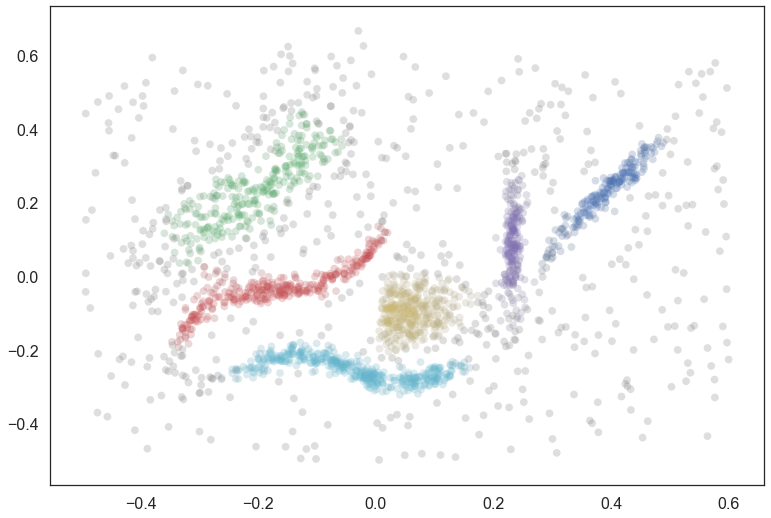
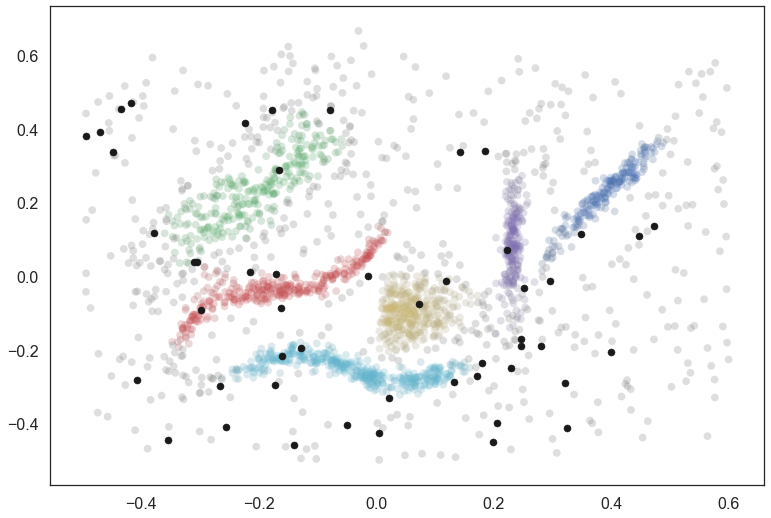
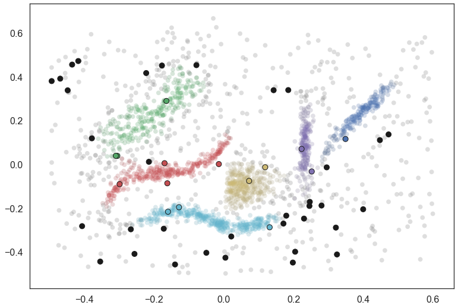

Predicting clusters for new points
==================================

Often it is useful to train a model once on a large amount of data, and
then query the model repeatedly with small amounts of new data. This is
hard for HDBSCAN\* as it is a transductive method -- new data points
can (and should!) be able to alter the underlying clustering. That is,
given new information it might make sense to create a new cluster, split
an existing cluster, or merge two previously separate clusters. If the
actual clusters (and hence their labels) change with each new data point
it becomes impossible to compare the cluster assignments between such
queries.

We can accommodate this by effectively holding a clustering fixed (after
a potentially expensive training run) and then asking: *if we do not
change the existing clusters* which cluster would HDBSCAN\* assign a new
data point to. In practice this amounts to determining where in the
condensed tree the new data point would fall (see
:any:`how_hdbscan_works`) assuming we do not change the condensed
tree. This allows for a very inexpensive operation to compute a
predicted cluster for the new data point.

This has been implemented in ``hdbscan`` as the
:py:func:`~hdbscan.predict.approximate_predict` function. We'll look
at how this works below.

As usual we begin with our test synthetic data set, and cluster it with
HDBSCAN. The primary point to note here, however, is the use of the
``prediction_data=True`` keyword argument. This ensures that HDBSCAN
does a little extra computation when fitting the model that can
dramatically speed up the prediction queries later.

You can also get an HDBSCAN object to create this data after the fact
via the :py:meth:`~hdbscan.HDBSCAN.generate_prediction_data` method.

.. code:: python

    data = np.load('clusterable_data.npy')
    clusterer = hdbscan.HDBSCAN(min_cluster_size=15, prediction_data=True).fit(data)
    pal = sns.color_palette('deep', 8)
    colors = [sns.desaturate(pal[col], sat) for col, sat in zip(clusterer.labels_, 
                                                                clusterer.probabilities_)]
    plt.scatter(data.T[0], data.T[1], c=colors, **plot_kwds);

Now to make things a little more interesting let's generate 50 new data
points scattered across the data. We can plot them in black to see where
they happen to fall.

.. code:: python

    test_points = np.random.random(size=(50, 2)) - 0.5
    
    colors = [sns.desaturate(pal[col], sat) for col, sat in zip(clusterer.labels_, 
                                                                clusterer.probabilities_)]
    plt.scatter(data.T[0], data.T[1], c=colors, **plot_kwds);
    plt.scatter(*test_points.T, c='k', s=50)

We can use the predict API on this data, calling
:py:func:`~hdbscan.predict.approximate_predict` with the HDBSCAN object,
and the numpy array of new points. Note that
:py:func:`~hdbscan.predict.approximate_predict` takes an *array* of new
points. If you have a single point be sure to wrap it in a list.

.. code:: python

    test_labels, strengths = hdbscan.approximate_predict(clusterer, test_points)
    test_labels

.. parsed-literal::

    array([ 2, -1, -1, -1, -1, -1,  1,  5, -1, -1,  5, -1, -1, -1, -1,  4, -1,
           -1, -1, -1, -1,  4, -1, -1, -1, -1,  2, -1, -1,  1, -1, -1, -1,  0,
           -1,  2, -1, -1,  3, -1, -1,  1, -1, -1, -1, -1, -1,  5,  3,  2])

The result is a set of labels as you can see. Many of the points as
classified as noise, but several are also assigned to clusters. This is
a very fast operation, even with large datasets, as long the HDBSCAN
object has the prediction data generated beforehand.

We can also visualize how this worked, coloring the new data points by
the cluster to which they were assigned. I have added black border
around the points so they don't get lost inside the clusters they fall
into.

.. code:: python

    colors = [sns.desaturate(pal[col], sat) for col, sat in zip(clusterer.labels_, 
                                                                clusterer.probabilities_)]
    test_colors = [pal[col] if col >= 0 else (0.1, 0.1, 0.1) for col in test_labels]
    plt.scatter(data.T[0], data.T[1], c=colors, **plot_kwds);
    plt.scatter(*test_points.T, c=test_colors, s=80, linewidths=1, edgecolors='k')

It is as simple as that. So now you can get started using HDBSCAN as a
streaming clustering service -- just be sure to cache your data and
retrain your model periodically to avoid drift!

