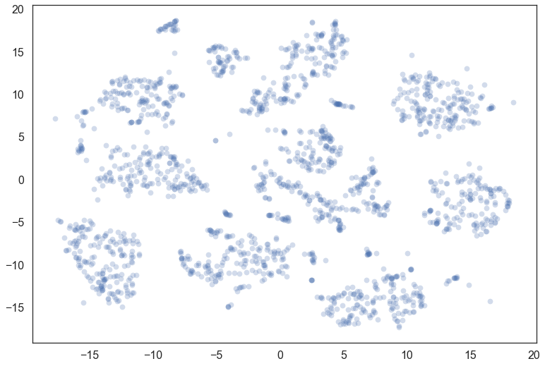
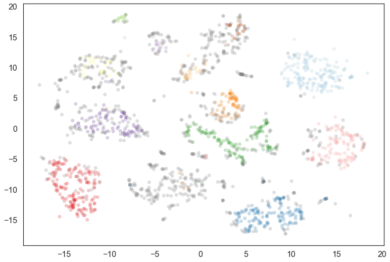
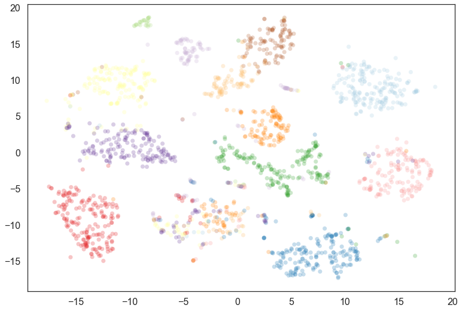
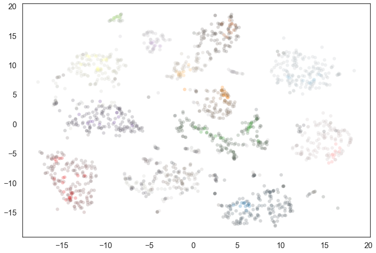
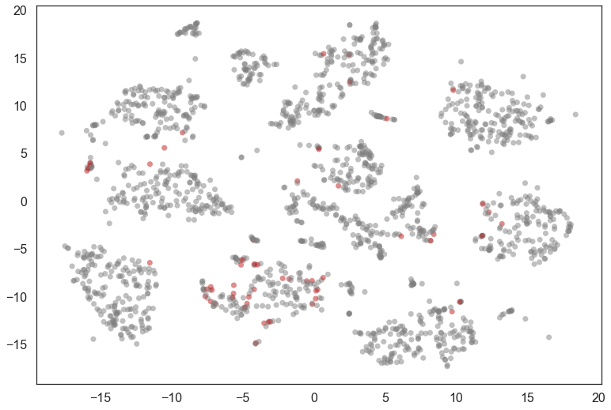
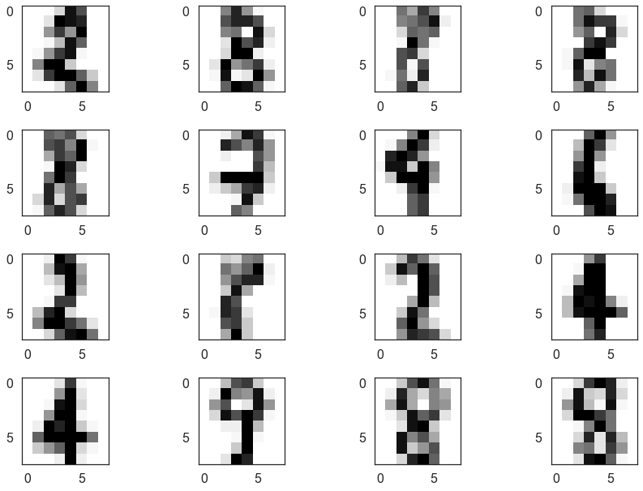

Soft Clustering for HDBSCAN\*
=============================

Soft clustering is a new (and still somewhat experimental) feature of
the hdbscan library. It takes advantage of the fact that the condensed
tree is a kind of smoothed density function over data points, and the
notion of exemplars for clusters. If you want to better understand how
soft clustering works please refer to :any:`soft_clustering_explanation`.

Let's consider the digits dataset from sklearn. We can project the data
into two dimensions to visualize it via t-SNE.

.. code:: python

    from sklearn import datasets
    from sklearn.manifold import TSNE
    import matplotlib.pyplot as plt
    import seaborn as sns
    import numpy as np

.. code:: python

    digits = datasets.load_digits()
    data = digits.data
    projection = TSNE().fit_transform(data)
    plt.scatter(*projection.T, **plot_kwds)

Now we import hdbscan and then cluster in the full 64 dimensional space.
It is important to note that, if we wish to use the soft clustering we
should use the ``prediction_data=True`` option for HDBSCAN. This will
ensure we generate the extra data required that will allow soft
clustering to work.

.. code:: python

    import hdbscan

.. code:: python

    clusterer = hdbscan.HDBSCAN(min_cluster_size=10, prediction_data=True).fit(data)
    color_palette = sns.color_palette('Paired', 12)
    cluster_colors = [color_palette[x] if x >= 0 
                      else (0.5, 0.5, 0.5) 
                      for x in clusterer.labels_]
    cluster_member_colors = [sns.desaturate(x, p) for x, p in 
                             zip(cluster_colors, clusterer.probabilities_)]
    plt.scatter(*projection.T, s=50, linewidth=0, c=cluster_member_colors, alpha=0.25)

Certainly a number of clusters were found, but the data is fairly noisy
in 64 dimensions, so there are a number of points that have been
classified as noise. We can generate a soft clustering to get more
information about some of these noise points.

To generate a soft clustering for all the points in the original dataset
we use the
:py:func:`~hdbscan.prediction.all_points_membership_vectors` function
which takes a clusterer object. If we wanted to get soft cluster
membership values for a set of new unseen points we could use
:py:func:`~hdbscan.prediction.membership_vector` instead.

The return value is a two-dimensional numpy array. Each point of the
input data is assigned a vector of probabilities of being in a cluster.
For a first pass we can visualize the data looking at what the *most
likely* cluster was, by coloring according to the ``argmax`` of the
probability vector (i.e. the cluster for which a given point has the
highest probability of being in).

.. code:: python

    soft_clusters = hdbscan.all_points_membership_vectors(clusterer)
    color_palette = sns.color_palette('Paired', 12)
    cluster_colors = [color_palette[np.argmax(x)]
                      for x in soft_clusters]
    plt.scatter(*projection.T, s=50, linewidth=0, c=cluster_colors, alpha=0.25)

This fills out the clusters nicely -- we see that there were many noise
points that are most likely to belong to the clusters we would expect;
we can also see where things have gotten confused in the middle, and
there is a mix of cluster assignments.

We are still only using part of the information however; we can
desaturate according to the actual probability value for the most likely
cluster.

.. code:: python

    color_palette = sns.color_palette('Paired', 12)
    cluster_colors = [sns.desaturate(color_palette[np.argmax(x)], np.max(x))
                      for x in soft_clusters]
    plt.scatter(*projection.T, s=50, linewidth=0, c=cluster_colors, alpha=0.25)

We see that many points actually have a low probability of being in the
cluster -- indeed the soft clustering applies *within* a cluster, so
only the very cores of each cluster have high probabilities. In practice
desaturating is a fairly string treatment; visually a lot will look
gray. We could apply a function and put a lower limit on the
desaturation that meets better with human visual perception, but that is
left as an exercise for the reader.

Instead we'll explore what else we can learn about the data from these
cluster membership probabilities. An interesting question is which
points have high likelihoods for *two* clusters (and low likelihoods for
the other clusters).

.. code:: python

    def top_two_probs_diff(probs):
        sorted_probs = np.sort(probs)
        return sorted_probs[-1] - sorted_probs[-2]
    
    # Compute the differences between the top two probabilities
    diffs = np.array([top_two_probs_diff(x) for x in soft_clusters])
    # Select out the indices that have a small difference, and a larger total probability
    mixed_points = np.where((diffs < 0.001) & (np.sum(soft_clusters, axis=1) > 0.5))[0]

.. code:: python

    colors = [(0.75, 0.1, 0.1) if x in mixed_points 
              else (0.5, 0.5, 0.5) for x in range(data.shape[0])]
    plt.scatter(*projection.T, s=50, linewidth=0, c=colors, alpha=0.5)

We can look at a few of these and see that many are, indeed, hard to
classify (even for humans). It also seems that 8 was not assigned a
cluster and is seen as a mixture of other clusters.

.. code:: python

    fig = plt.figure()
    for i, image in enumerate(digits.images[mixed_points][:16]):
        ax = fig.add_subplot(4,4,i+1)
        ax.imshow(image)
    plt.tight_layout()

There is, of course, a lot more analysis that can be done from here, but
hopefully this provides sufficient introduction to what can be achieved
with soft clustering.

