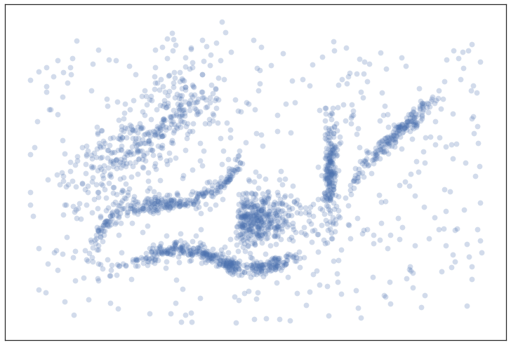
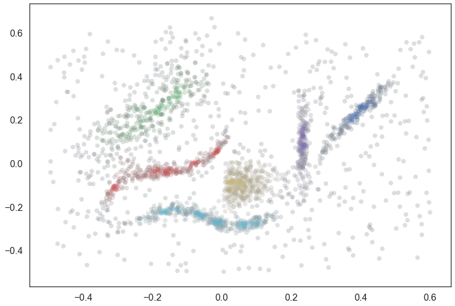
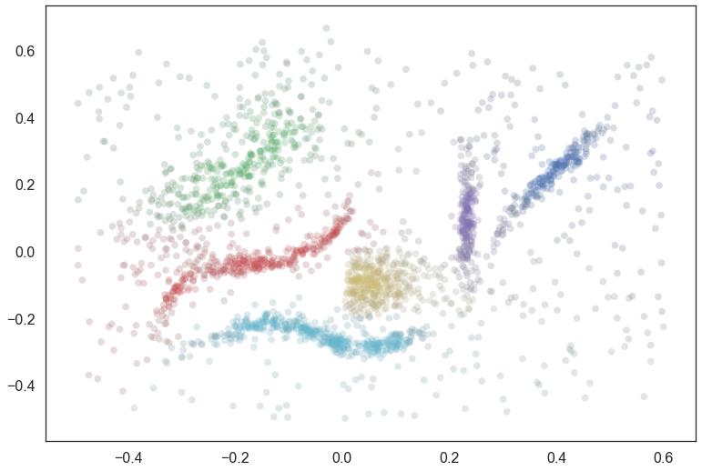

How Soft Clustering for HDBSCAN Works
=====================================

This is a general description of how the soft clustering algorithm for
HDBSCAN Works. We will implement soft clustering from scratch -- not in
the efficient way that the `hdbscan
library <https://github.com/scikit-learn-contrib/hdbscan>`__ implements
it, but in a way that makes it clearer what is actually going on.

What is Soft Clustering?
------------------------

To start, we'll provide a quick primer on what soft clustering is, and
why you might want it in the first place. Traditional clustering assigns
each point in a data set to a cluster (or to noise). This is a hard
assignment; there are no mixed memberships. A point near the edge of one
cluster and also close to a second cluster, is just as much "in the
first cluster" as a point solidly in the center that is very distant
from the second cluster. Equally, if the clustering algorithm supports
noise assignments, then points are simply assigned as "noise". We are
left with no idea as to which, if any cluster, they might have just
missed the cut on being in.

The remedy for this is 'soft clustering' or 'fuzzy clustering'. In this
approach points are not assigned cluster labels, but are instead assigned
a vector of probabilities. The length of the vector is equal to the
number of clusters found. The probability value at the :math:`i`\ th
entry of the vector is the probability that that point is a member of
the :math:`i`\ th cluster. This allows points to potentially be a mix of
clusters. By looking at the vector a data scientist can discern how
strongly a point is in a cluster, and which other clusters it is related
to. Equally noise point will usually be assigned low probabilities of
being in any cluster, but you can discern which clusters they are closer
to, or even if they were very nearly part of a cluster. This is a much
richer and more informative clustering result ... so how do we get it?

Soft Clustering for HDBSCAN
---------------------------

We want to produce a method of providing a soft membership vector for a
given point across the selected clusters of a clustering. Ideally we
want this to be interpretable as a probability of being a member of that
cluster. For now we will work solely with categorizing points already in
the clustered data set, but in principle this can be extended to new
previously unseen points presuming we have a method to insert such
points into the condensed tree (see other discussions on how to handle
"prediction"). First let's get some test data, and an associated
clustering so we have some idea of what we're working with in our test
example.

.. code:: python

    import hdbscan
    import numpy as np
    import matplotlib.pyplot as plt
    import seaborn as sns
    import pandas as pd
    import matplotlib as mpl
    
    from scipy.spatial.distance import cdist
    
    %matplotlib inline
    sns.set_context('poster')
    sns.set_style('white')
    sns.set_color_codes()
    
    plot_kwds={'alpha':0.25, 's':60, 'linewidths':0}
    palette = sns.color_palette('deep', 12)

.. code:: python

    data = np.load('clusterable_data.npy')
    fig = plt.figure()
    ax = fig.add_subplot(111)
    plt.scatter(data.T[0], data.T[1], **plot_kwds)
    ax.set_xticks([])
    ax.set_yticks([]);

Now let's build a clusterer and fit it to this data.

.. code:: python

    clusterer = hdbscan.HDBSCAN(min_cluster_size=15).fit(data)

We can visualize the resulting clustering (using the soft cluster scores
to vary the saturation so that we gain some intuition about how soft the
clusters may be) to get an idea of what we are looking at:

.. code:: python

    pal = sns.color_palette('deep', 8)
    colors = [sns.desaturate(pal[col], sat) for col, sat in zip(clusterer.labels_, 
                                                                clusterer.probabilities_)]
    plt.scatter(data.T[0], data.T[1], c=colors, **plot_kwds);

.. image:: images/soft_clustering_explanation_6_0.png

Suppose now that we have a data point and we want to get a notion of how
close it is to each of the clusters. There are at least two ways we can
thing about this. The first approach is to take the question somewhat
literally and consider the distance from the cluster. As can be seen in
our example, however, clusters need not have clear centers (they may be
linear, or oddly shaped); even if we get a notion of distance it may not
follow the "cluster manifold distance" and hence may be somewhat less
than ideal. The second way of looking at things is to consider how much
of an outlier the point is relative to each cluster -- using something
akin to the outlier scores from GLOSH. The advantage of this approach is
that it handles odd shaped clusters (even toroidal clusters) far better
since it will explicitly follow the manifolds of the clusters. The down
side of the outlier approach is that many points will all be equally
"outlying", particularly noise points. Our goal is to fuse these two
ideas.

Distance Based Membership
-------------------------

First we'll build a vector for a purely distance based vector of
possible cluster membership -- essentially just asking "which cluster am
I closest to?". To start this process we need some notion of exemplar
point for each cluster to measure distance to. This is tricky since our
clusters may have off shapes. In practice there isn't really any single
clear exemplar for a cluster. The right solution, then, is to have a set
of exemplar points for each cluster? How do we determine which points
those should be? They should be the points that persist in the the
cluster (and it's children in the HDBSCAN condensed tree) for the
longest range of lambda values -- such points represent the "heart" of
the cluster around which the ultimate cluster forms.

In practice we want to be careful and get the most persistent points in
each leaf cluster beneath the cluster we are considering. This is
because as a oddly shaped cluster breaks down it will split into
subclusters. We don't want simply the most persistent of those
subclusters, but rather representatives of each subcluster.

We can write this as a simple function to generate exemplar points. We
work through the condensed tree, get the leaf clusters beneath a given
cluster, and then find the points with maximum lambda value in that
leaf. If we combine all those points together we get "exemplars".

.. code:: python

    def exemplars(cluster_id, condensed_tree):
        raw_tree = condensed_tree._raw_tree
        # Just the cluster elements of the tree, excluding singleton points
        cluster_tree = raw_tree[raw_tree['child_size'] > 1]
        # Get the leaf cluster nodes under the cluster we are considering
        leaves = hdbscan.plots._recurse_leaf_dfs(cluster_tree, cluster_id)
        # Now collect up the last remaining points of each leaf cluster (the heart of the leaf)
        result = np.array([])
        for leaf in leaves:
            max_lambda = raw_tree['lambda_val'][raw_tree['parent'] == leaf].max()
            points = raw_tree['child'][(raw_tree['parent'] == leaf) & 
                                       (raw_tree['lambda_val'] == max_lambda)]
            result = np.hstack((result, points))
        return result.astype(np.int)

We can plot the exemplars so you can get a sense of what points are
being pulled out as exemplars for each cluster. First we plot all the
data in gray, and then plot the exemplars for each cluster over the top,
following the coloring used in the plot of the clusters above.

.. code:: python

    tree = clusterer.condensed_tree_
    plt.scatter(data.T[0], data.T[1], c='grey', **plot_kwds)
    for i, c in enumerate(tree._select_clusters()):
        c_exemplars = exemplars(c, tree)
        plt.scatter(data.T[0][c_exemplars], data.T[1][c_exemplars], c=palette[i], **plot_kwds)

.. image:: images/soft_clustering_explanation_11_0.png

You can see the several leaves in action here, with the red and cyan
clusters having several subclusters stretched along their length.

Now to compute a cluster membership score for a point we need to simply
compute the distance to each of the cluster exemplar sets and scale
membership scores accordingly. In practice we work with the inverse
distance (just as HDBCSAN handles things with lambda values in the
tree). Whether we do a softmax or simply normalize by dividing by the
sum is "to be determined" as there isn't necessarily a clear answer.
We'll leave it as an option in the code.

.. code:: python

    def min_dist_to_exemplar(point, cluster_exemplars, data):
        dists = cdist([data[point]], data[cluster_exemplars.astype(np.int32)])
        return dists.min()
    
    def dist_vector(point, exemplar_dict, data):
        result = {}
        for cluster in exemplar_dict:
            result[cluster] = min_dist_to_exemplar(point, exemplar_dict[cluster], data)
        return np.array(list(result.values()))
        
    def dist_membership_vector(point, exemplar_dict, data, softmax=False):
        if softmax:
            result = np.exp(1./dist_vector(point, exemplar_dict, data))
            result[~np.isfinite(result)] = np.finfo(np.double).max
        else:
            result = 1./dist_vector(point, exemplar_dict, data)
            result[~np.isfinite(result)] = np.finfo(np.double).max
        result /= result.sum()
        return result

We can get some sense of what this is doing by assigning every point to
a cluster via the membership vector, and desaturating according to the
strength of membership.

.. code:: python

    exemplar_dict = {c:exemplars(c,tree) for c in tree._select_clusters()}
    colors = np.empty((data.shape[0], 3))
    for x in range(data.shape[0]):
        membership_vector = dist_membership_vector(x, exemplar_dict, data)
        color = np.argmax(membership_vector)
        saturation = membership_vector[color]
        colors[x] = sns.desaturate(pal[color], saturation)
    plt.scatter(data.T[0], data.T[1], c=colors, **plot_kwds);

As you can see this is something that is a step in the right direction,
but we are not following the manifold well. For example there is spill
over between the cyan and yellow clusters, the red and yellow clusters,
the red and green clusters, and the purple and blue clusters in a way
that is not really ideal. This is because we are using pure distance
(rather than any sort of cluster/manifold/density aware distance) and
latching on to whatever is closest. What we need is an approach the
understands the cluster structure better -- something based off the the
actual structure (and lambda values therein) of the condensed tree.
This is exactly the sort of approach something based on outlier scores
can provide.

Outlier Based Membership
------------------------

We want a notion of membership that follows the density based notions
upon which the clustering is actually built. This is actually not too
hard to arrange via a modification of the GLOSH algorithm for providing
outlier scores. In that algorithm, given a point, we find the closest
cluster in the condensed tree and then compare how long the point stayed
in that cluster to the total persistence of the heart of the cluster. If
we modify this to instead find the merge height of the point with a
fixed cluster and then perform the same comparison of the points
membership persistence with the maximum persistence of the cluster we
can get a measure of how much of an outlier the point is *relative to
the fixed cluster*. If we perform this calculation for each of the
clusters we can get a vector of outlier scores. We can then normalize
that (again, whether by softmax, or simply divide by the sum) to get a
cluster membership vector.

To start we'll need some utility functions. These are far from the most
efficient way to do this (in terms of compute time) but they demonstrate
what is going on more clearly.

.. code:: python

    def max_lambda_val(cluster, tree):
        cluster_tree = tree[tree['child_size'] > 1]
        leaves = hdbscan.plots._recurse_leaf_dfs(cluster_tree, cluster)
        max_lambda = 0.0
        for leaf in leaves:
            max_lambda = max(max_lambda, 
                             tree['lambda_val'][tree['parent'] == leaf].max())
        return max_lambda
    
    def points_in_cluster(cluster, tree):
        leaves = hdbscan.plots._recurse_leaf_dfs(tree, cluster)
        return leaves

Next we'll need a function to find the merge height. We'll presume we've
used the above functions to precompute a dict of points for every
cluster in our cluster tree.

.. code:: python

    def merge_height(point, cluster, tree, point_dict):
        cluster_row = tree[tree['child'] == cluster]
        cluster_height = cluster_row['lambda_val'][0]
        if point in point_dict[cluster]:
            merge_row = tree[tree['child'] == float(point)][0]
            return merge_row['lambda_val']
        else:
            while point not in point_dict[cluster]:
                parent_row = tree[tree['child'] == cluster]
                cluster = parent_row['parent'].astype(np.float64)[0]
            for row in tree[tree['parent'] == cluster]:
                child_cluster = float(row['child'])
                if child_cluster == point:
                    return row['lambda_val']
                if child_cluster in point_dict and point in point_dict[child_cluster]:
                    return row['lambda_val']

Now we can create a scoring function, providing an outlier score
relative to each cluster. Now we'll assume we have a precomputed dict of
maximum lambda values for each cluster, and a precomputed list of
cluster\_ids.

.. code:: python

    def per_cluster_scores(point, cluster_ids, tree, max_lambda_dict, point_dict):
        result = {}
        point_row = tree[tree['child'] == point]
        point_cluster = float(point_row[0]['parent'])
        max_lambda = max_lambda_dict[point_cluster] + 1e-8 # avoid zero lambda vals in odd cases
        
        for c in cluster_ids:
            height = merge_height(point, c, tree, point_dict)
            result[c] = (max_lambda / (max_lambda - height))
        return result

Finally we can write our function to provide an outlier based membership
vector, leaving an option for using softmax instead of straightforward
normalization.

.. code:: python

    def outlier_membership_vector(point, cluster_ids, tree, 
                                  max_lambda_dict, point_dict, softmax=True):
        if softmax:
            result = np.exp(np.array(list(per_cluster_scores(point, 
                                                             cluster_ids, 
                                                             tree,
                                                             max_lambda_dict,
                                                             point_dict
                                                            ).values())))
            result[~np.isfinite(result)] = np.finfo(np.double).max
        else:
            result = np.array(list(per_cluster_scores(point, 
                                                      cluster_ids, 
                                                      tree,
                                                      max_lambda_dict,
                                                      point_dict
                                                     ).values()))
        result /= result.sum()
        return result

We can apply the same approach as before to get a general notion of what
this approach has done for us, coloring points by the most likely
cluster and then desaturating according to the actual membership
strength.

.. code:: python

    cluster_ids = tree._select_clusters()
    raw_tree = tree._raw_tree
    all_possible_clusters = np.arange(data.shape[0], raw_tree['parent'].max() + 1).astype(np.float64)
    max_lambda_dict = {c:max_lambda_val(c, raw_tree) for c in all_possible_clusters}
    point_dict = {c:set(points_in_cluster(c, raw_tree)) for c in all_possible_clusters}
    colors = np.empty((data.shape[0], 3))
    for x in range(data.shape[0]):
        membership_vector = outlier_membership_vector(x, cluster_ids, raw_tree, 
                                                      max_lambda_dict, point_dict, False)
        color = np.argmax(membership_vector)
        saturation = membership_vector[color]
        colors[x] = sns.desaturate(pal[color], saturation)
    plt.scatter(data.T[0], data.T[1], c=colors, **plot_kwds);

We see that we follow the clusters much better with this approach, but
now everything is somewhat desaturated, and there are many points, even
points quite close to one cluster (and far from others) that are pure
gray. Thus while we follow the clusters well we've lost a certain amount
of locality information since at certain distance scales many points
join/leave a cluster at the same time, so they all get the same relative
score across clusters. The ideal would be to combine the two sets of
information that we have -- the cluster oriented and the locality
oriented. That is the middle way which we will pursue.

The Middle Way
--------------

We need a way to combine these two approaches. The first point to note
is that we can view the resulting membership vectors as probability mass
functions for the probability that the point is a member of each
cluster. Given two observations of PMFs the natural approach is simply
to combine them via Bayes' to get a new posterior distribution. This is
easy enough to arrange.

.. code:: python

    def combined_membership_vector(point, data, tree, exemplar_dict, cluster_ids,
                                   max_lambda_dict, point_dict, softmax=False):
        raw_tree = tree._raw_tree
        dist_vec = dist_membership_vector(point, exemplar_dict, data, softmax)
        outl_vec = outlier_membership_vector(point, cluster_ids, raw_tree, 
                                             max_lambda_dict, point_dict, softmax)
        result = dist_vec * outl_vec
        result /= result.sum()
        return result

Again we can have some manner of window on the results by plotting
points colored and desaturated according to the most likely cluster and
the probability that the point is "in" that cluster.

.. code:: python

    colors = np.empty((data.shape[0], 3))
    for x in range(data.shape[0]):
        membership_vector = combined_membership_vector(x, data, tree, exemplar_dict, cluster_ids,
                                                       max_lambda_dict, point_dict, False)
        color = np.argmax(membership_vector)
        saturation = membership_vector[color]
        colors[x] = sns.desaturate(pal[color], saturation)
    plt.scatter(data.T[0], data.T[1], c=colors, **plot_kwds);

This looks a lot closer to what we had in mind -- We have cluster
membership following manifolds, and noise points near clusters taking on
some shades of the appropriate hue. Our one remaining problem is related
to the noise points -- they are unlikely to be in any cluster, not
merely a smear across the probabilities of being in any particular
cluster.

Converting a Conditional Probability
------------------------------------

What we have computed so far is a probability vector that a point is in
each cluster conditional on the point being in a cluster (since the sum
of the vector is one, implying that, with probability one the point is
in some cluster). We wish to convert this to a vector of probabilities
with no such conditional. We can convert the conditional to the joint
probability easily

.. math:: P(x\in C_i | \exists j : x \in C_j) \cdot P(\exists j : x\in C_j) = P(x\in C_i , \exists j : x \in C_j)

But then we just note that

.. math::  P(x\in C_i , \exists j : x \in C_j) = P(x\in C_i)

since :math:`P(\exists j : x \in C_j) = 1` whenever :math:`x\in C_i`. We
then only need to estimate :math:`P(\exists j : x\in C_j)`, and we can
do that by simply comparing the merge height to the nearest cluster with
the maximum lambda of that cluster.

.. code:: python

    def prob_in_some_cluster(point, tree, cluster_ids, point_dict, max_lambda_dict):
        heights = []
        for cluster in cluster_ids:
            heights.append(merge_height(point, cluster, tree._raw_tree, point_dict))
        height = max(heights)
        nearest_cluster = cluster_ids[np.argmax(heights)]
        max_lambda = max_lambda_dict[nearest_cluster]
        return height / max_lambda

The result is that we merely need to multiply our combined membership
vector to get a vector of probabilities of being in a cluster. We can
visualize the results again.

.. code:: python

    colors = np.empty((data.shape[0], 3))
    for x in range(data.shape[0]):
        membership_vector = combined_membership_vector(x, data, tree, exemplar_dict, cluster_ids,
                                                       max_lambda_dict, point_dict, False)
        membership_vector *= prob_in_some_cluster(x, tree, cluster_ids, point_dict, max_lambda_dict)
        color = np.argmax(membership_vector)
        saturation = membership_vector[color]
        colors[x] = sns.desaturate(pal[color], saturation)
    plt.scatter(data.T[0], data.T[1], c=colors, **plot_kwds);

And there we have the result!

